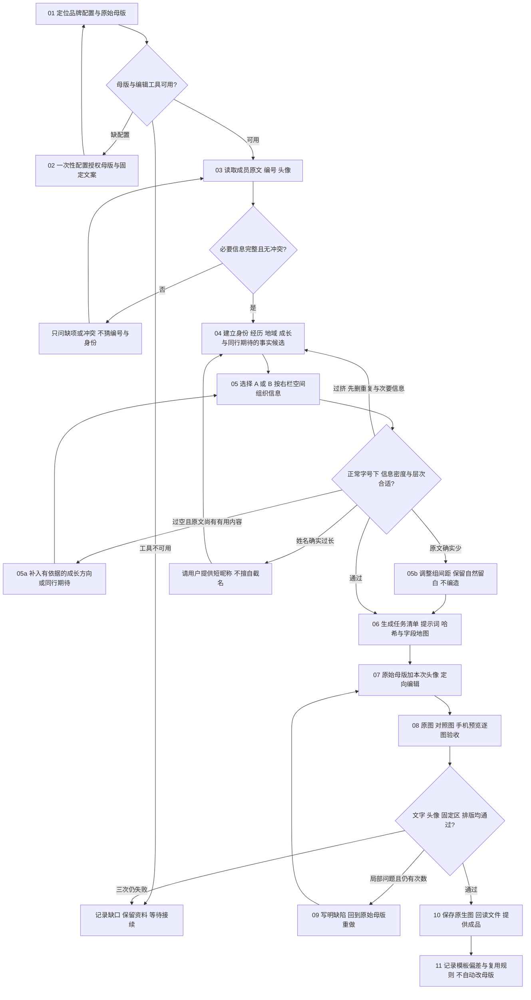

# V2 · 欢迎海报生产流程

流程固定，成员内容按事实适配。图中每个节点对应下表，运行状态与证据留在本次私有任务目录；客户只收到海报。

| 节点 | 输入 / 动作 | 需要用户回答的条件 | 产物和证据 | 通过条件 / 失败返回 |
|---|---|---|---|---|
| 01 | 当前请求、品牌配置；读配置，核验原图与校验值，查看选用母版 | 配置缺失才进入02 | 配置版本、母版哈希、工具可用性 | 原图可读且哈希相符；变更未确认则查源，不使用缓存缩略图 |
| 02 | 用户授权的满意成稿；定义固定文案、动态区域、旧成员字段、两套独立版式 | 首次配置需确认母版/品牌内容；已有配置不再问 | 私有 profile 与原图，授权范围说明 | 不把含旧客户信息的母版放入公开包；完成回01 |
| 03 | 原始简介、昵称、编号、头像 | 缺昵称/编号/头像，或来源冲突 | 原文及原头像引用 | 编号按字符串保留前导零；缺项回补齐 |
| 04 | 原文；提取主身份、相关经历、地域，以及有意义的成长方向/同行期待，逐行附原文证据 | 关键身份无法判定时才问 | 事实候选及上图取舍；愿望保留愿望状态，曾任不写成现任 | 不补造资历、业绩、所在地；不把模板旧事实填入空位 |
| 05 / 05a / 05b | 默认B；头像优先或长昵称优先A。按头像与条码之间的实际空间选择信息和分组；过空时补有依据的次级内容，过挤时先提炼。原文确实少则调整间距 | 仅姓名无法容纳时问简称；不为补满版面索要多余资料 | 模板ID、姓名行、正文分组、容量及密度判断 | 正文通常2—5短行，但无最低凑数要求；两行姓名时最多3行正文。正常字号、清楚层次、自然留白；容量只是初筛，真实看图仍须过关 |
| 06 | 配置、头像、事实卡；运行prepare_job.py或等效人工流程 | 无 | job.json、prompt.txt、两张输入的SHA256、允许编辑的区域 | 昵称只附加一次“同学”；动态文案唯一，无未替换占位符 |
| 07 | 指定原始母版为编辑目标，头像为插入素材 | 只有工具/API路线需新授权时才问 | 原生候选图、工具模式、完整提示词、尝试次数 | 每次回原始母版，绝不用上位成员成品或上一失败图继续编辑 |
| 08 | 候选、母版、头像、事实卡；按quality.md验收，特别查看右栏的信息密度和身份/期待的层次 | 无；成品通过后可交付，不强制审批 | 实际原图查看、约390像素宽预览、逐项QA记录 | 核心文字逐字正确、无旧资料、头像相符、信息不空散也不挤满；字号/固定结构/质感无明显漂移；OCR不能代替目视 |
| 09 | 失败条目；仅收紧对应提示，重用同一原始输入 | 三次仍不能达标，报告具体缺口 | 新候选及失败原因，保留历史 | 每件最多3次实际生成；不无限重试、不假称完成 |
| 10 | 通过的原生文件；另存到授权位置并回读 | 未指定路径时沿用当前任务合理目录 | 海报、真实尺寸、哈希、最终状态 | 不覆盖原件；不把插值放大说成原生高清，不外发消息 |
| 11 | 实际QA与用户反馈 | 变更固定文案/母版才确认 | 私有生产记录，可复用改进候选 | 新成员成品不会自动晋升为模板；维护时先改流程再同步各文件 |

## 可接续记录

任务记录保留 `current_node`、`status`（needs_input / ready / generated / qa_failed / passed）、`template_id`、输入校验值、尝试次数、失败原因、输出引用，以及正文分组和密度判断。恢复时先回读文件，不凭聊天声称已完成。缺失地区属于允许的空值；清除旧地名后，可以在同一成员正文区域排入真实的成长方向或同行期待，不把期待塞进地域字段。详见[信息密度适配](content-fit.md)。

## 完成边界

“接近1:1”指沿用所选母版的构图、光影、材质、字号层级和固定文案。生成式编辑会重绘像素，不能保证逐像素一致、每次零错字或原头像完全无变化。真实不符合时应重试/报告，不降低标准换取通过。
