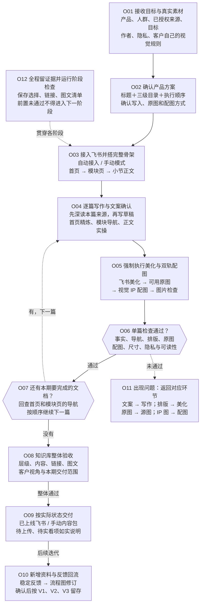
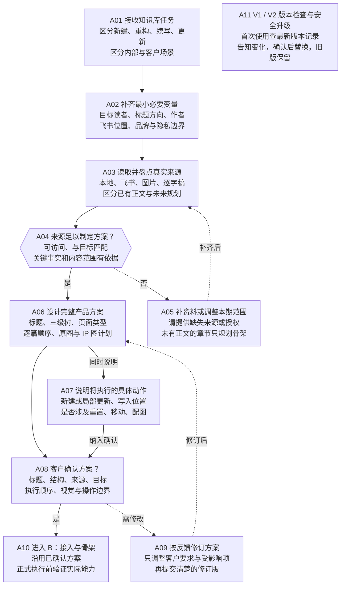
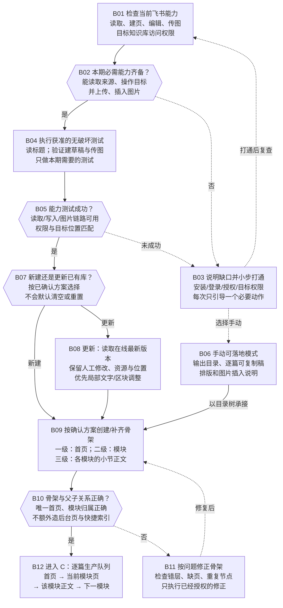
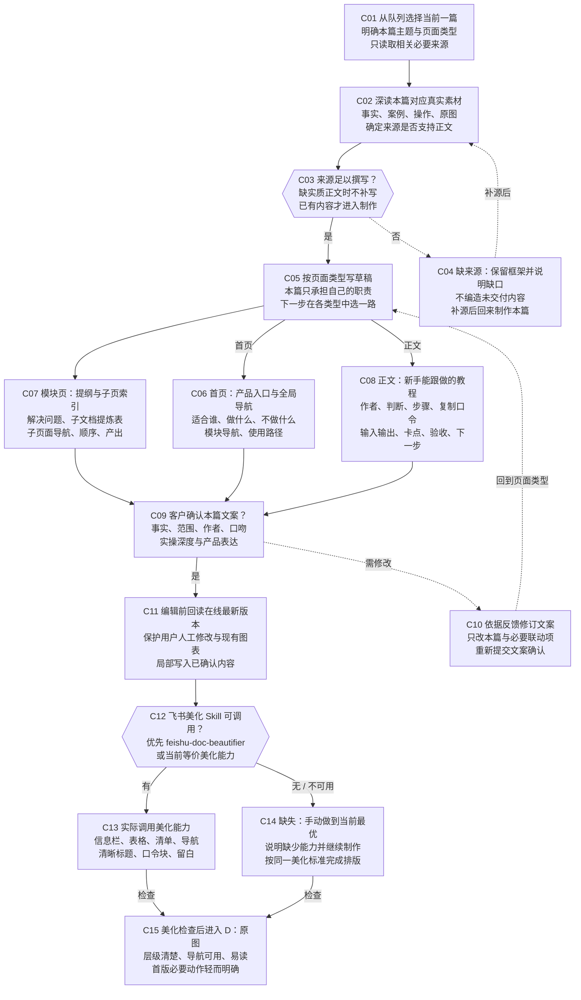
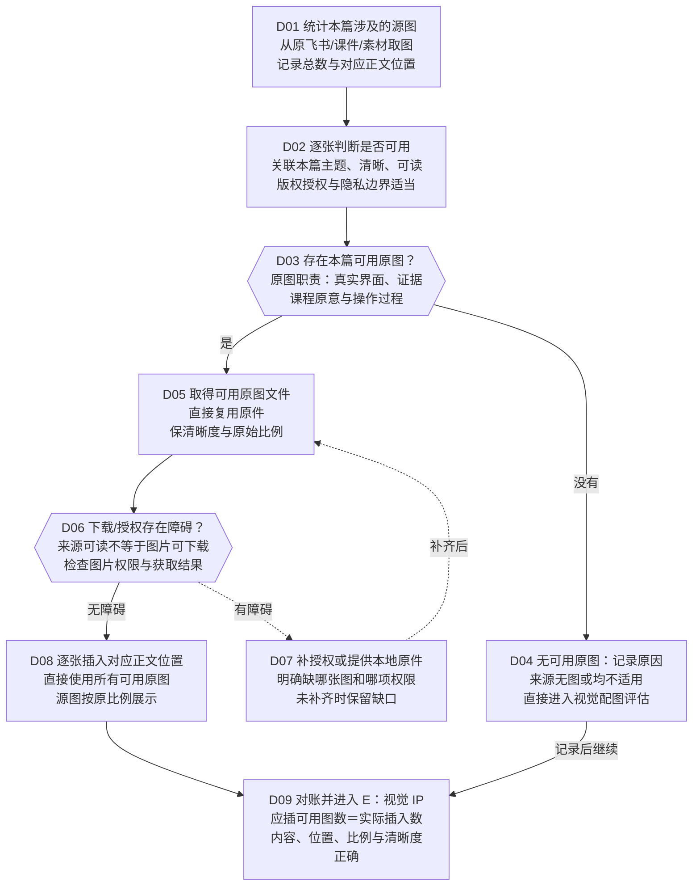
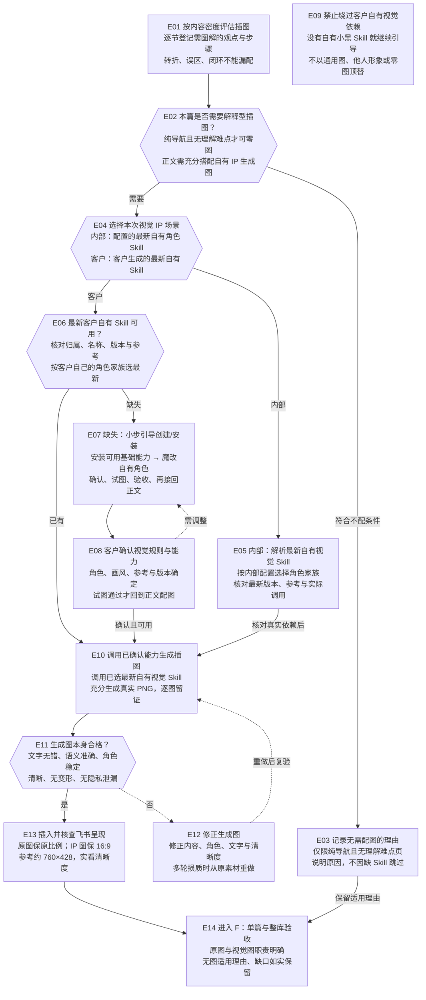
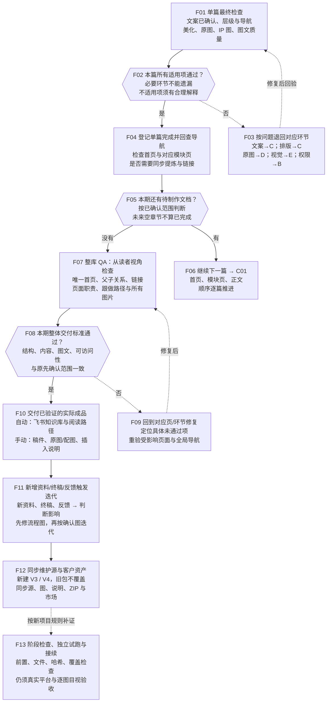

# V2 确定流程图与节点操作

执行顺序：plan → access → 每篇 copy → beautify → originals → visual → page；所有本期必需页面通过后 final。默认一次完成一篇。图、workflow.json、脚本与说明保持同版。

蓝：执行；黄：确认；紫：判断；红：失败返回；绿：出口；虚线：说明与阻止跳过。

## 飞书知识库产品一键生成｜流程总览

V2 确定流程：按已确认的业务选择执行；阶段脚本检查记录与文件，真实调用、目视与飞书效果另须实际验收。

|节点 / 阶段|输入与动作|客户参与|产物与验收|失败返回|
|---|---|---|---|---|
|O01 / overview|前序产物；产品、人群、来源、飞书目标；作者、口吻、隐私、视觉规则|无需新增提问；沿用已确认选择|最小必要信息；资料边界可说明|未满足条件则修复对应环节后复验，不标完成|
|O02 / overview|前序产物；标题＋三级目录＋执行顺序；确认写入、原图和配图方式|是否同意这份具体方案？|已确认方案；|不满意则改方案后再确认|
|O03 / overview|前序产物；自动接入 / 手动模式；首页 → 模块页 → 小节正文|无需新增提问；沿用已确认选择|目录骨架与文档队列；只有一个首页；模块与小节父子关系正确|未满足条件则修复对应环节后复验，不标完成|
|O04 / overview|前序产物；先深读本篇来源，再写草稿；首页精炼、模块导航、正文实操|本篇文案是否准确、够用？|阶段产物；|退回本篇草稿；不提前配图|
|O05 / overview|前序产物；飞书美化 → 可用原图；→ 视觉 IP 配图 → 图片检查|无需新增提问；沿用已确认选择|阶段产物；顺序正确；原图完整；生成图服务理解|未满足条件则修复对应环节后复验，不标完成|
|O06 / overview|前序产物；事实、导航、排版、原图；配图、尺寸、隐私与可读性|无需新增提问；沿用已确认选择|阶段产物；缺关键证据不能称完成|按问题类型返回对应制作环节|
|O07 / overview|前序产物；回查首页和模块页的导航；按顺序继续下一篇|无需新增提问；沿用已确认选择|阶段产物；未完结课程的空框架不算正文完成|未满足条件则修复对应环节后复验，不标完成|
|O08 / overview|前序产物；层级、内容、链接、图文；客户视角与本期交付范围|无需新增提问；沿用已确认选择|阶段产物；整体可阅读、可导航、可跟做|未满足条件则修复对应环节后复验，不标完成|
|O09 / overview|前序产物；已上线飞书 / 手动内容包；待上传、待实看项如实说明|无需新增提问；沿用已确认选择|阶段产物；手动稿不冒称已上线；不自动公开发布|未满足条件则修复对应环节后复验，不标完成|
|O10 / overview|前序产物；稳定规则 → 方法与 Skill；源文件、说明、模板、ZIP 同步|无需新增提问；沿用已确认选择|阶段产物；仅稳定且有依据的规则进入迭代|未满足条件则修复对应环节后复验，不标完成|
|O11 / overview|前序产物；文案 → 写作；排版 → 美化；原图 → 源图；IP 图 → 配图|无需新增提问；沿用已确认选择|阶段产物；|修复后重新检查受影响环节|
|O12 / overview|前序产物；本期范围、逐篇状态、链接；源图清单、失败项、下一步|无需新增提问；沿用已确认选择|阶段产物；恢复时回读真实产物，不能只凭聊天摘要|未满足条件则修复对应环节后复验，不标完成|

## A｜目标、素材与产品方案

先读来源再定结构；关键选择一次确认并沿用，不让客户代做 Agent 能完成的整理。

|节点 / 阶段|输入与动作|客户参与|产物与验收|失败返回|
|---|---|---|---|---|
|A01 / plan|用户任务与指定素材；区分新建、重构、续写、更新；区分内部与客户场景|无需新增提问；沿用已确认选择|任务类型与本期目标；本轮要交付什么可一句话说明|范围不清先补问|
|A02 / plan|前序产物；目标读者、标题方向、作者；飞书位置、品牌与隐私边界|仅询问无法从现有资料确认的关键项|变量清单与已有授权；不重复询问已确认项|未满足条件则修复对应环节后复验，不标完成|
|A03 / plan|用户已提供或明确授权读取的资料；只读核对来源、版本与图片；不据此获得写入、清空、移动或发布授权|无需新增提问；沿用已确认选择|来源目录、阅读范围与缺口；关键来源实际读到，阅读权限与写入权限分开|权限或来源不足进入 A05|
|A04 / plan|前序产物；可访问、与目标匹配；关键事实和内容范围有依据|无需新增提问；沿用已确认选择|阶段产物；不依靠编造补齐内容|补资料，或提出缩小范围的选择|
|A05 / plan|前序产物；请提供缺失来源或授权；未有正文的章节只规划骨架|补齐来源，还是缩小本期制作范围？|新来源或调整后的范围；缩小范围须客户确认|关键缺口未解决时保留待完成状态|
|A06 / plan|前序产物；标题、三级树、页面类型；逐篇顺序、原图与 IP 图计划|无需新增提问；沿用已确认选择|可审核方案；知识库层级与文档内标题层级分开设计|未满足条件则修复对应环节后复验，不标完成|
|A07 / plan|前序产物；新建或局部更新、写入位置；是否涉及重置、移动、配图|无需新增提问；沿用已确认选择|动作范围与影响清单；删除/清空/移动不能藏在普通制作授权里|未满足条件则修复对应环节后复验，不标完成|
|A08 / plan|前序产物；标题、结构、来源、目标；执行顺序、视觉与操作边界|是否同意方案及所列动作？|确认结论；已有明确授权不重复问|变更则 A09 后重新确认|
|A09 / plan|前序产物；只调整客户要求与受影响项；再提交清楚的修订版|无需新增提问；沿用已确认选择|修订方案；未确认前不执行具体写入或生图|未满足条件则修复对应环节后复验，不标完成|
|A10 / plan|前序产物；沿用已确认方案；正式执行前验证实际能力|无需新增提问；沿用已确认选择|已确认的执行输入；方案与本期范围一致|未满足条件则修复对应环节后复验，不标完成|
|A11 / plan|前序产物；首次使用查公开版本记录；有新版时说明差异再确认替换|只有发现新版并要替换时才需确认|阶段产物；离线时说明未核验更新，不阻止使用当前已安装版|未满足条件则修复对应环节后复验，不标完成|

## B｜飞书接入、保护原内容与搭建骨架

先完成获准的低风险能力验证；没有自动写入能力时转手动交付，不把内容稿称为已上线。

|节点 / 阶段|输入与动作|客户参与|产物与验收|失败返回|
|---|---|---|---|---|
|B01 / access|A10 已确认方案与目标链接；读取、建页、编辑、传图；目标知识库访问权限|无需新增提问；沿用已确认选择|能力与权限结果；以实际调用结果判断，不凭工具名字|未满足条件则修复对应环节后复验，不标完成|
|B02 / access|前序产物；能读取来源、操作目标；并上传、插入图片|无需新增提问；沿用已确认选择|阶段产物；只验证任务需要的能力|未满足条件则修复对应环节后复验，不标完成|
|B03 / access|前序产物；安装/登录/授权/目标权限；每次只引导一个必要动作|是否补齐必要权限，或改走手动内容模式？|授权与可用能力更新；不把密钥写进文档、日志或交付包|未满足条件则修复对应环节后复验，不标完成|
|B04 / access|前序产物；读标题；验证建草稿与传图；只做本期需要的测试|无需新增提问；沿用已确认选择|真实读取、建页、图片测试结果；不清空、不删除；写入测试在已确认范围内|测试失败返回权限与能力检查|
|B05 / access|前序产物；读取/写入/图片链路可用；权限与目标位置匹配|无需新增提问；沿用已确认选择|阶段产物；登录成功不等于目标知识库可写|未满足条件则修复对应环节后复验，不标完成|
|B06 / access|前序产物；输出目录、逐篇可复制稿；排版和图片插入说明|无需新增提问；沿用已确认选择|手动制作与上传路径；仍须文案确认、美化、配图与反馈验收|没有在线反馈则不得称飞书成品完成|
|B07 / access|前序产物；按已确认方案选择；不会默认清空或重置|仅在既有授权不清楚时确认操作范围|阶段产物；默认保护原内容和原节点|未满足条件则修复对应环节后复验，不标完成|
|B08 / access|前序产物；保留人工修改、资源与位置；优先局部文字/区块调整|无需新增提问；沿用已确认选择|本次更新基线与局部修改范围；写入前重新读取；无授权不移动节点|版本发生变化时重新比对再写入|
|B09 / access|前序产物；一级：首页；二级：模块；三级：各模块的小节正文|无需新增提问；沿用已确认选择|完整目录骨架或手动目录树；未有来源的正文可留空，不编造内容|建页失败查权限与实际已建状态再继续|
|B10 / access|前序产物；唯一首页、模块归属正确；不额外造后台页与快捷索引|无需新增提问；沿用已确认选择|结构检查结论；目录规划完成不等于正文完成|未满足条件则修复对应环节后复验，不标完成|
|B11 / access|前序产物；检查错层、缺页、重复节点；只执行已经授权的修正|无需新增提问；沿用已确认选择|阶段产物；需要删除/移动时先核对授权|修复后重验结构|
|B12 / access|前序产物；首页 → 当前模块页；→ 该模块正文 → 下一模块|无需新增提问；沿用已确认选择|有顺序的本期文档列表；默认一次一篇；未来章节不抢写|未满足条件则修复对应环节后复验，不标完成|

## C｜单篇写作、文案确认与飞书美化

知识库节点固定三级；文档内部标题按内容安排，二者不是同一种层级。

|节点 / 阶段|输入与动作|客户参与|产物与验收|失败返回|
|---|---|---|---|---|
|C01 / copy|B12 或 F04 的下一篇；明确本篇主题与页面类型；只读取相关必要来源|无需新增提问；沿用已确认选择|当前文档与制作范围；不抢后续章节内容|未满足条件则修复对应环节后复验，不标完成|
|C02 / copy|前序产物；事实、案例、操作、原图；确定来源是否支持正文|无需新增提问；沿用已确认选择|本篇内容依据与图片清单；不能拿规划课题当已授课正文|未满足条件则修复对应环节后复验，不标完成|
|C03 / copy|前序产物；缺实质正文时不补写；已有内容才进入制作|无需新增提问；沿用已确认选择|阶段产物；每个关键事实有来源|未满足条件则修复对应环节后复验，不标完成|
|C04 / copy|前序产物；不编造未交付内容；补源后回来制作本篇|补齐来源，或调整本期交付范围？|未完成项与来源需求；空框架不能标为正文已完成|未经确认不自行缩小必需交付范围|
|C05 / copy|前序产物；本篇只承担自己的职责；下一步在各类型中选一路|无需新增提问；沿用已确认选择|首页 / 模块 / 正文的写作路线；|未满足条件则修复对应环节后复验，不标完成|
|C06 / copy|前序产物；适合谁、做什么、不做什么；模块导航、使用路径|无需新增提问；沿用已确认选择|精炼首页草稿；不写成长教程；全局导航完整|未满足条件则修复对应环节后复验，不标完成|
|C07 / copy|前序产物；解决问题、子文档提炼表；子页面导航、顺序、产出|无需新增提问；沿用已确认选择|精炼模块草稿；必须有子页面导航；不抢正文步骤|未满足条件则修复对应环节后复验，不标完成|
|C08 / copy|前序产物；作者、判断、步骤、复制口令；输入输出、卡点、验收、下一步|无需新增提问；沿用已确认选择|详细正文草稿；Agent 做诊断整理；用户只确认补充选择|未满足条件则修复对应环节后复验，不标完成|
|C09 / copy|前序产物；事实、范围、作者、口吻；实操深度与产品表达|本篇文案是否准确、完整、符合你的表达？|已确认文案；|返回对应类型草稿修改；不提前生图|
|C10 / copy|前序产物；只改本篇与必要联动项；重新提交文案确认|无需新增提问；沿用已确认选择|修订稿；事实变更必须有依据|未满足条件则修复对应环节后复验，不标完成|
|C11 / beautify|已确认文案与在线目标；保护用户人工修改与现有图表；局部写入已确认内容|无需新增提问；沿用已确认选择|受保护的最新编辑基线；手动模式则生成对应可复制排版稿|未满足条件则修复对应环节后复验，不标完成|
|C12 / beautify|前序产物；优先 feishu-doc-beautifier；或当前等价美化能力|无需新增提问；沿用已确认选择|阶段产物；有能力就实际使用，不只建议调用|未满足条件则修复对应环节后复验，不标完成|
|C13 / beautify|前序产物；信息栏、表格、清单、导航；清晰标题、口令块、留白|无需新增提问；沿用已确认选择|美化后的文档或排版稿；较长文通常 3–7 个并列一级模块；按需展开二三级|未满足条件则修复对应环节后复验，不标完成|
|C14 / beautify|前序产物；说明缺少能力并继续制作；按同一美化标准完成排版|无需新增提问；沿用已确认选择|手动美化文档或可复制排版稿；缺 Skill 不能成为跳过美化的理由|未满足条件则修复对应环节后复验，不标完成|
|C15 / beautify|前序产物；层级清楚、导航可用、易读；首版必要动作轻而明确|无需新增提问；沿用已确认选择|阶段产物；排版问题先修复；不要没美化就配图|返回 C13/C14 修复排版|

## D｜原图盘点、获取、复用与完整性检查

真实源图用于证据与操作；生成图用于解释。图中清单是验收要求，不代表已有自动对账脚本。

|节点 / 阶段|输入与动作|客户参与|产物与验收|失败返回|
|---|---|---|---|---|
|D01 / originals|C15 的已美化文档与本篇来源；从原飞书/课件/素材取图；记录总数与对应正文位置|无需新增提问；沿用已确认选择|原图总量与候选清单；清楚知道来源有多少图，不凭印象挑几张|未满足条件则修复对应环节后复验，不标完成|
|D02 / originals|前序产物；关联本篇主题、清晰、可读；版权授权与隐私边界适当|无需新增提问；沿用已确认选择|可用原图与不可用项；本篇所有可用原图都复用；不等于全库图片复制到每篇|未满足条件则修复对应环节后复验，不标完成|
|D03 / originals|前序产物；原图职责：真实界面、证据；课程原意与操作过程|无需新增提问；沿用已确认选择|阶段产物；源图没有时不能伪造截图补数|未满足条件则修复对应环节后复验，不标完成|
|D04 / originals|前序产物；来源无图或均不适用；直接进入视觉配图评估|无需新增提问；沿用已确认选择|原图环节不适用原因；仅本环节无图；不自动跳过视觉配图|未满足条件则修复对应环节后复验，不标完成|
|D05 / originals|前序产物；直接复用原件；保清晰度与原始比例|无需新增提问；沿用已确认选择|可用原图原件；不以截图拼接替代原图|未满足条件则修复对应环节后复验，不标完成|
|D06 / originals|前序产物；来源可读不等于图片可下载；检查图片权限与获取结果|无需新增提问；沿用已确认选择|阶段产物；下载失败不能当作已经插入|未满足条件则修复对应环节后复验，不标完成|
|D07 / originals|前序产物；明确缺哪张图和哪项权限；未补齐时保留缺口|请补必要授权或本地原图；是否调整范围另行明确|可用原件或仍未完成项；不擅自用生成图顶替真实证据|必需原图未取得，不能标完整复用|
|D08 / originals|前序产物；直接使用所有可用原图；源图按原比例展示|无需新增提问；沿用已确认选择|已插入的原图与位置；手动模式则交付原图及逐张插入说明|未满足条件则修复对应环节后复验，不标完成|
|D09 / originals|前序产物；应插可用图数＝实际插入数；内容、位置、比例与清晰度正确|无需新增提问；沿用已确认选择|源图复用结论与未完成项；缺图回 D05/D08，变形重设显示比例|修复后重新检查；不能只报上传成功|

## E｜视觉 IP 依赖、配图数量、生成与图片验收

必须进入配图评估；数量按内容决定。短而无理解难点的模块页可不配，须说明适用原因。

|节点 / 阶段|输入与动作|客户参与|产物与验收|失败返回|
|---|---|---|---|---|
|E01 / visual|D09 的文档及已插原图；判断、实操动作、易卡点；转折、输入输出与闭环节点|无需新增提问；沿用已确认选择|配图位置、目的与数量；每个重要理解点有图解或充分的原图依据；不能以最少张数为目标|未满足条件则修复对应环节后复验，不标完成|
|E02 / visual|前序产物；仅纯导航且无理解难点页可记录有依据的不适用；正文充分搭配最新自有视觉小黑生成图，逐节检查覆盖|无需新增提问；沿用已确认选择|阶段产物；正文至少实际生成一张只是下限，充分性仍由逐节覆盖决定，不固定两张或上限|未满足条件则修复对应环节后复验，不标完成|
|E03 / visual|前序产物；仅适用内容标准允许的情况；不能因依赖缺失自行跳过|无需新增提问；沿用已确认选择|无需配图的内容判断；不把正文默认降为零配图|未满足条件则修复对应环节后复验，不标完成|
|E04 / visual|前序产物；内部：配置的自有角色；客户：客户自己的角色和规则|无需新增提问；沿用已确认选择|阶段产物；未经授权不用他人专属形象替代客户|未满足条件则修复对应环节后复验，不标完成|
|E05 / visual|前序产物；内部配置指向经用户确认的最新自有视觉小黑 Skill；不把内部配置或角色资产装入客户包|沿用已确认内部角色；同家族选择最新可用版|匹配内容与角色的真实依赖；本次仅核实文件存在，未做生图调用验收|未满足条件则修复对应环节后复验，不标完成|
|E06 / visual|前序产物；确认名称、角色、参考图；风格、表情、尺寸与禁用项|已有哪个视觉 IP Skill 或参考包？|阶段产物；不能凭文件修改时间混入他人的角色；并列或归属不明时只问必要选择|未满足条件则修复对应环节后复验，不标完成|
|E07 / visual|前序产物；读取客户允许的基础 Skill 与许可，分小步安装并魔改为客户自有视觉小黑 Skill；客户确认关键命名与角色后，实际生成试图并验收|无需新增提问；沿用已确认选择|客户视觉规则与可调用能力；安装、魔改和真实试图均通过，不能把写好提示词当可用|需要配图但能力未通时保留待完成项|
|E08 / visual|前序产物；核实形象符合客户意图；实际具备生成和交付能力|是否同意这套形象、画风与生成方案？|确认后的视觉依赖；安装成功不等于调用可用|不满意则修订 E07|
|E09 / visual|前序产物；客户没有自有视觉小黑 Skill 就回到安装与魔改引导，直到真实试图通过；不得用通用图、他人形象或零图替代|仅在客户明确改变交付目标时重新确认方案|阶段产物；依赖缺口解决且真实试图验收通过后才继续正文配图|未满足条件则修复对应环节后复验，不标完成|
|E10 / visual|前序产物；默认 16:9 PNG、形象一致；按内容位置解释具体卡点|无需新增提问；沿用已确认选择|原始插图文件；内部遵循白底手绘及既定风格；客户按自己的规则|未满足条件则修复对应环节后复验，不标完成|
|E11 / visual|前序产物；文字无错、语义准确、角色稳定；清晰、无变形、无隐私泄漏|无需新增提问；沿用已确认选择|阶段产物；生成成功不是质量验收|按问题重新生成，不接受失真图|
|E12 / visual|前序产物；修正内容、角色、文字与清晰度；多轮损质时从原素材重做|无需新增提问；沿用已确认选择|替换图；不得把解释图画成伪造截图或案例证据|未满足条件则修复对应环节后复验，不标完成|
|E13 / visual|前序产物；原图保原比例；IP 图保 16:9；参考约 760×428，实看清晰度|无需新增提问；沿用已确认选择|已插入的视觉 IP 图与检查结论；检查 512×512、白下巴、压缩拉伸、模糊和语义位置|源图本身有问题回 E10；显示问题修正尺寸/位置|
|E14 / visual|前序产物；原图与视觉图职责明确；无图适用理由、缺口如实保留|无需新增提问；沿用已确认选择|阶段产物；内容包交付与在线交付分开；目标为在线成品时须真实回读和预览|未满足条件则修复对应环节后复验，不标完成|

## F｜逐篇完成、整库验收、交付与迭代

完成状态分别记录：骨架、文案、排版、原图、IP 图、单篇验收、整体交付。

|节点 / 阶段|输入与动作|客户参与|产物与验收|失败返回|
|---|---|---|---|---|
|F01 / page|E14 的本篇文档及证据；文案已确认、层级与导航；美化、原图、IP 图、图文质量|无需新增提问；沿用已确认选择|单篇检查结论；事实准确、作者正确、无内部话术/未脱敏信息|未满足条件则修复对应环节后复验，不标完成|
|F02 / page|前序产物；必要环节不能遗漏；不适用项须有合理解释|无需新增提问；沿用已确认选择|阶段产物；没有通过就不能说该篇已完成|未满足条件则修复对应环节后复验，不标完成|
|F03 / page|前序产物；文案→C；排版→C；原图→D；视觉→E；权限→B|无需新增提问；沿用已确认选择|具体修复点与重验范围；文案若实质变更，重走文案确认及受影响后序环节|未满足条件则修复对应环节后复验，不标完成|
|F04 / page|前序产物；检查首页与对应模块页；是否需要同步提炼与链接|无需新增提问；沿用已确认选择|完成文档、检查结论、下一篇；仅登记真实通过的阶段；手动稿与在线完成分开|未满足条件则修复对应环节后复验，不标完成|
|F05 / page|前序产物；按已确认范围判断；未来空章节不算已完成|无需新增提问；沿用已确认选择|阶段产物；必需来源缺失时不自行缩减范围后宣布完成|未满足条件则修复对应环节后复验，不标完成|
|F06 / page|前序产物；首页、模块页、正文；顺序逐篇推进|无需新增提问；沿用已确认选择|下一篇输入与已有确认；|未满足条件则修复对应环节后复验，不标完成|
|F07 / final|前序产物；唯一首页、父子关系、链接；页面职责、跟做路径与所有图片|无需新增提问；沿用已确认选择|整体 QA 结论；价格权益等动态事实确认；无编造、无后台话术|未满足条件则修复对应环节后复验，不标完成|
|F08 / final|前序产物；结构、内容、图文、可访问性；与原先确认范围一致|无需新增提问；沿用已确认选择|阶段产物；空目录或局部验收不等于知识库成品|未满足条件则修复对应环节后复验，不标完成|
|F09 / final|前序产物；定位具体未通过项；重验受影响页面与全局导航|无需新增提问；沿用已确认选择|阶段产物；修好一个问题不能覆盖其他未完成项|未满足条件则修复对应环节后复验，不标完成|
|F10 / final|前序产物；自动：飞书知识库与阅读路径；手动：稿件、原图/配图、插入说明|无需新增提问；沿用已确认选择|本期交付物、完成/未完成状态；手动稿未迁入飞书时只称内容包完成；不自动发布或发消息|未满足条件则修复对应环节后复验，不标完成|
|F11 / final|前序产物；先读新来源，判断影响；只修改相关页面和稳定规则|无需新增提问；沿用已确认选择|内容更新与 Skill 迭代候选；临时想法、私密数据不机械复制进客户包|未满足条件则修复对应环节后复验，不标完成|
|F12 / final|前序产物；新建下一 Vn 目录，保留所有历史源、图、说明与 ZIP；同步当前安装及唯一正式市场版本|无需新增提问；沿用已确认选择|同步资产与更新记录（真正修改时）；ZIP 根目录直接有 SKILL.md；保质量优先规则；客户可见去专属信息|未满足条件则修复对应环节后复验，不标完成|
|F13 / final|前序产物；保存选择、产物、验收、缺口；用不同素材试跑并验真实结果|无需新增提问；沿用已确认选择|逐阶段证据与可接续记录；脚本通过不代替业务、视觉和实际平台验收|未满足条件则修复对应环节后复验，不标完成|
