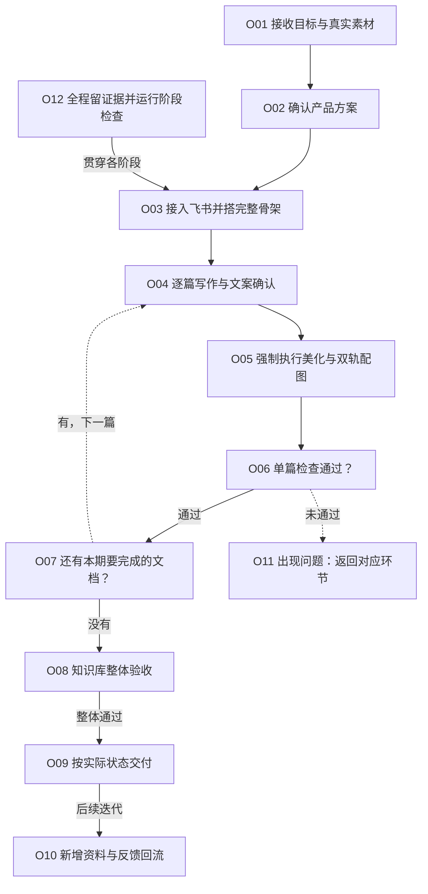
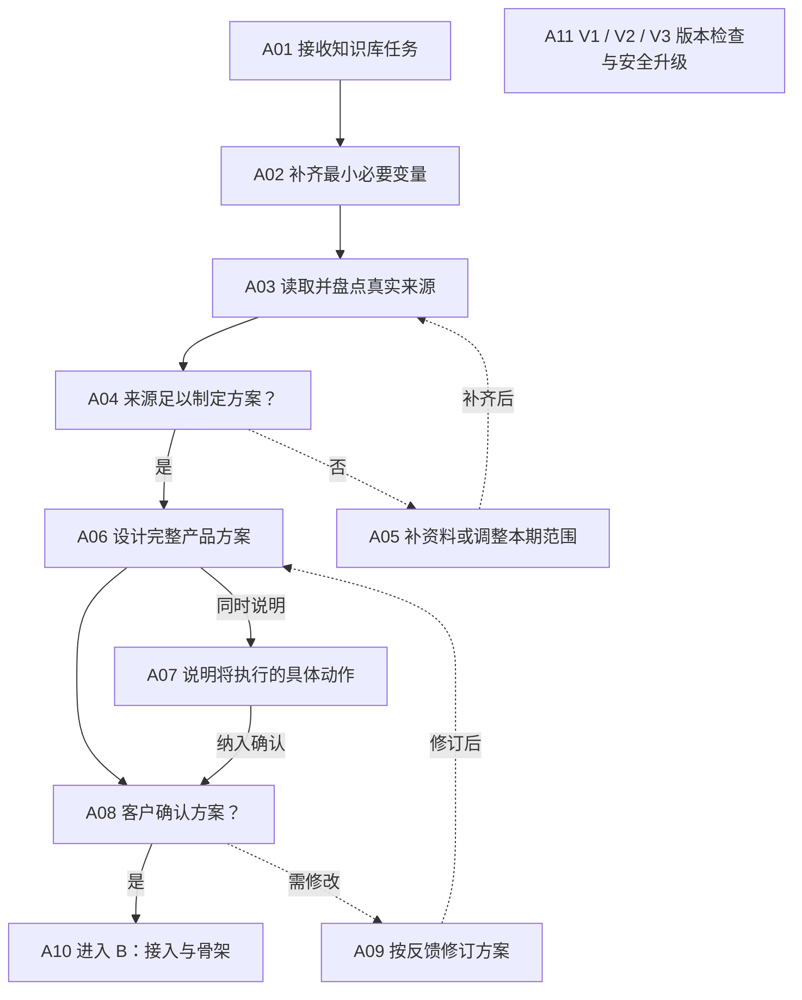
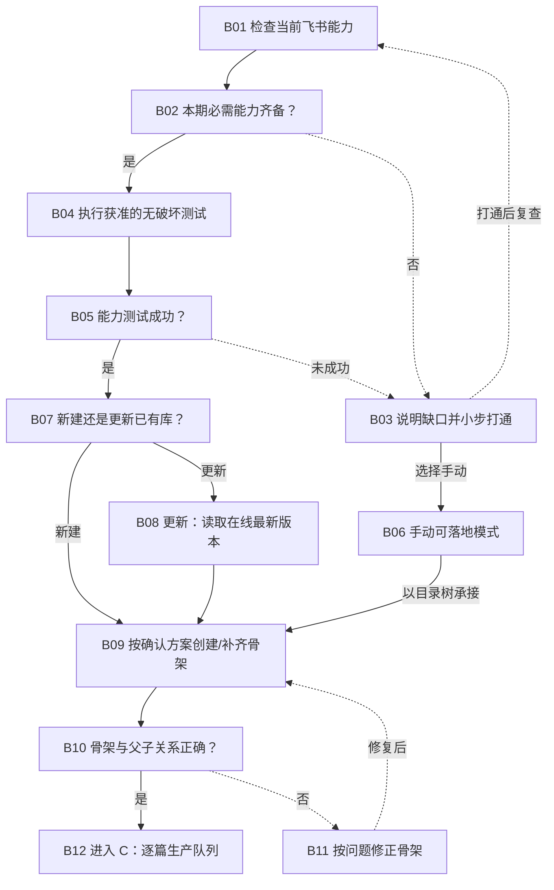
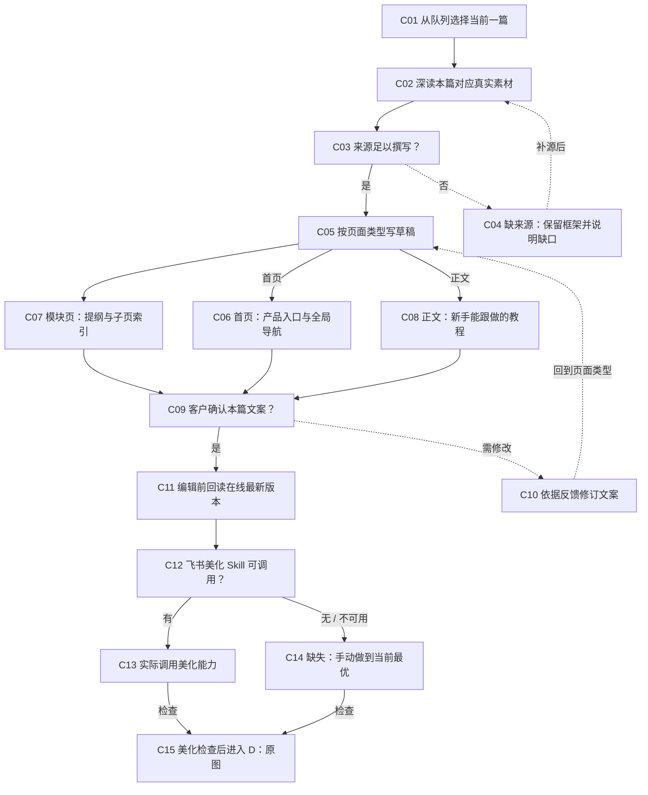
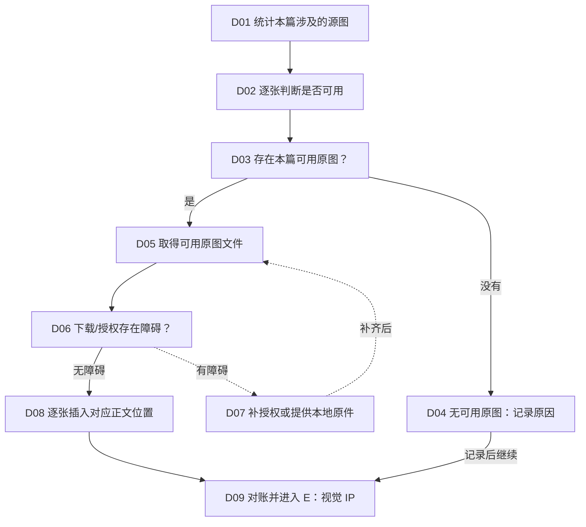
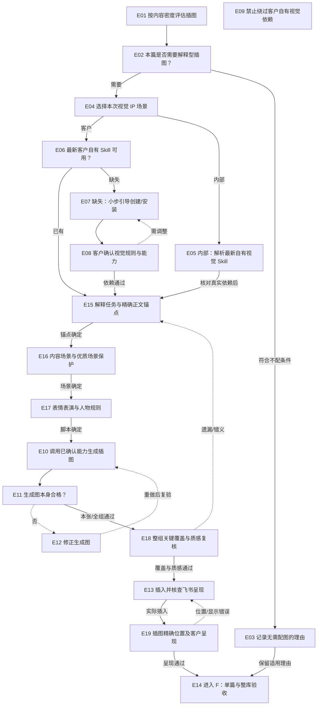
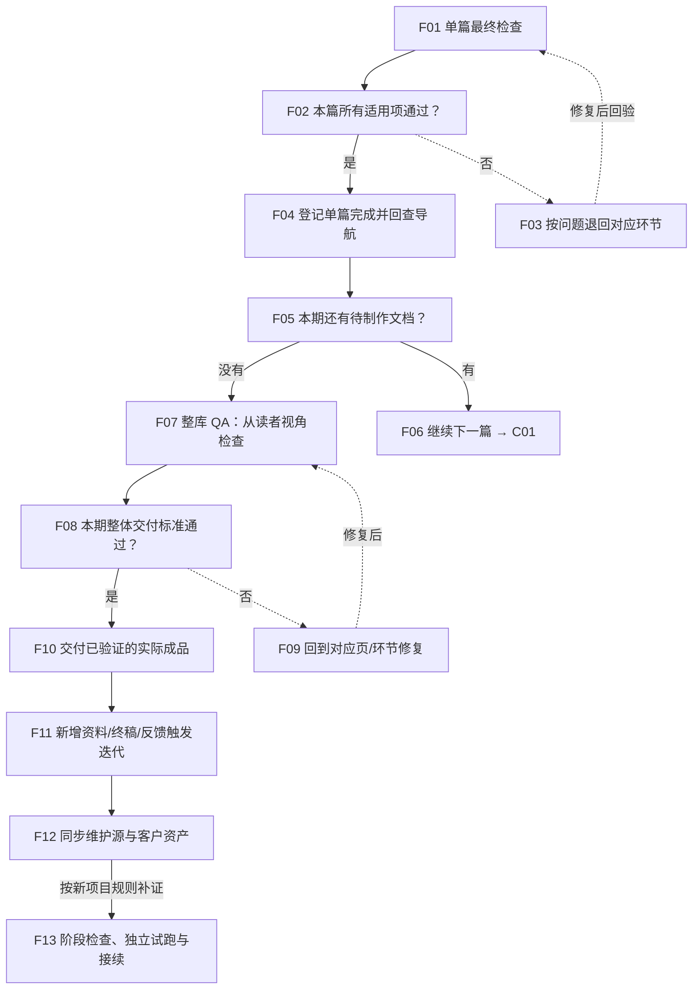
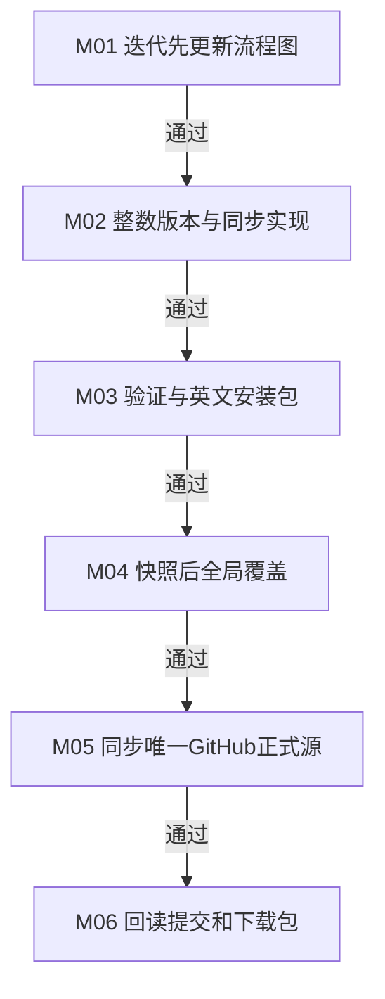

# V3 确定流程图与逐节点执行卡

当前明确建议已作为本轮确定选择；先改此图，再更新实现。失败返回对应节点，已确认选择不重问。

## 飞书知识库产品一键生成｜流程总览

|节点|输入|动作|客户确认|产物/证据|通过条件|失败返回|接续|
|---|---|---|---|---|---|---|---|
|O01 接收目标与真实素材|前序节点实际产物与已确认选择|产品、人群、来源、飞书目标；作者、口吻、隐私、视觉规则|无需新增提问；沿用已确认选择|最小必要信息；实际来源、动作结果、检查及产物记录|资料边界可说明|回到本节点修复并重验受影响环节|['O02']|
|O02 确认产品方案|前序节点实际产物与已确认选择|标题＋三级目录＋执行顺序；确认写入、原图和配图方式|是否同意这份具体方案？|已确认方案；实际来源、动作结果、检查及产物记录|关键项与真实证据齐全才通过|不满意则改方案后再确认|['O03']|
|O03 接入飞书并搭完整骨架|前序节点实际产物与已确认选择|自动接入 / 手动模式；首页 → 模块页 → 小节正文|无需新增提问；沿用已确认选择|目录骨架与文档队列；实际来源、动作结果、检查及产物记录|只有一个首页；模块与小节父子关系正确|回到本节点修复并重验受影响环节|['O04']|
|O04 逐篇写作与文案确认|前序节点实际产物与已确认选择|先深读本篇来源，再写草稿；首页精炼、模块导航、正文实操|本篇文案是否准确、够用？|本节点产物与接续状态；实际来源、动作结果、检查及产物记录|关键项与真实证据齐全才通过|退回本篇草稿；不提前配图|['O05']|
|O05 强制执行美化与双轨配图|前序节点实际产物与已确认选择|飞书美化 → 可用原图；→ 视觉 IP 配图 → 图片检查|无需新增提问；沿用已确认选择|本节点产物与接续状态；实际来源、动作结果、检查及产物记录|顺序正确；原图完整；生成图服务理解|回到本节点修复并重验受影响环节|['O06']|
|O06 单篇检查通过？|前序节点实际产物与已确认选择|事实、导航、排版、原图；配图、尺寸、隐私与可读性|无需新增提问；沿用已确认选择|本节点产物与接续状态；实际来源、动作结果、检查及产物记录|缺关键证据不能称完成|按问题类型返回对应制作环节|['O07']|
|O07 还有本期要完成的文档？|前序节点实际产物与已确认选择|回查首页和模块页的导航；按顺序继续下一篇|无需新增提问；沿用已确认选择|本节点产物与接续状态；实际来源、动作结果、检查及产物记录|未完结课程的空框架不算正文完成|回到本节点修复并重验受影响环节|['O08']|
|O08 知识库整体验收|前序节点实际产物与已确认选择|层级、内容、链接、图文；客户视角与本期交付范围|无需新增提问；沿用已确认选择|本节点产物与接续状态；实际来源、动作结果、检查及产物记录|整体可阅读、可导航、可跟做|回到本节点修复并重验受影响环节|['O09']|
|O09 按实际状态交付|前序节点实际产物与已确认选择|已上线飞书 / 手动内容包；待上传、待实看项如实说明|无需新增提问；沿用已确认选择|本节点产物与接续状态；实际来源、动作结果、检查及产物记录|手动稿不冒称已上线；不自动公开发布|回到本节点修复并重验受影响环节|['O10']|
|O10 新增资料与反馈回流|前序节点实际产物与已确认选择|稳定规则 → 方法与 Skill；源文件、说明、模板、ZIP 同步|无需新增提问；沿用已确认选择|本节点产物与接续状态；实际来源、动作结果、检查及产物记录|仅稳定且有依据的规则进入迭代|回到本节点修复并重验受影响环节|出口/接续|
|O11 出现问题：返回对应环节|前序节点实际产物与已确认选择|文案 → 写作；排版 → 美化；原图 → 源图；IP 图 → 配图|无需新增提问；沿用已确认选择|本节点产物与接续状态；实际来源、动作结果、检查及产物记录|关键项与真实证据齐全才通过|修复后重新检查受影响环节|出口/接续|
|O12 全程留证据并运行阶段检查|前序节点实际产物与已确认选择|本期范围、逐篇状态、链接；源图清单、失败项、下一步|无需新增提问；沿用已确认选择|本节点产物与接续状态；实际来源、动作结果、检查及产物记录|恢复时回读真实产物，不能只凭聊天摘要|回到本节点修复并重验受影响环节|出口/接续|

## A｜目标、素材与产品方案

|节点|输入|动作|客户确认|产物/证据|通过条件|失败返回|接续|
|---|---|---|---|---|---|---|---|
|A01 接收知识库任务|用户任务与指定素材|区分新建、重构、续写、更新；区分内部与客户场景|无需新增提问；沿用已确认选择|任务类型与本期目标；实际来源、动作结果、检查及产物记录|本轮要交付什么可一句话说明|范围不清先补问|['A02']|
|A02 补齐最小必要变量|前序节点实际产物与已确认选择|目标读者、标题方向、作者；飞书位置、品牌与隐私边界|仅询问无法从现有资料确认的关键项|变量清单与已有授权；实际来源、动作结果、检查及产物记录|不重复询问已确认项|回到本节点修复并重验受影响环节|['A03']|
|A03 读取并盘点真实来源|用户已提供或明确授权读取的资料|只读核对来源、版本与图片；不据此获得写入、清空、移动或发布授权|无需新增提问；沿用已确认选择|来源目录、阅读范围与缺口；实际来源、动作结果、检查及产物记录|关键来源实际读到，阅读权限与写入权限分开|权限或来源不足进入 A05|['A04']|
|A04 来源足以制定方案？|前序节点实际产物与已确认选择|可访问、与目标匹配；关键事实和内容范围有依据|无需新增提问；沿用已确认选择|本节点产物与接续状态；实际来源、动作结果、检查及产物记录|不依靠编造补齐内容|补资料，或提出缩小范围的选择|['A06']|
|A05 补资料或调整本期范围|前序节点实际产物与已确认选择|请提供缺失来源或授权；未有正文的章节只规划骨架|补齐来源，还是缩小本期制作范围？|新来源或调整后的范围；实际来源、动作结果、检查及产物记录|缩小范围须客户确认|关键缺口未解决时保留待完成状态|出口/接续|
|A06 设计完整产品方案|前序节点实际产物与已确认选择|标题、三级树、页面类型；逐篇顺序、原图与 IP 图计划|无需新增提问；沿用已确认选择|可审核方案；实际来源、动作结果、检查及产物记录|知识库层级与文档内标题层级分开设计|回到本节点修复并重验受影响环节|['A08', 'A07']|
|A07 说明将执行的具体动作|前序节点实际产物与已确认选择|新建或局部更新、写入位置；是否涉及重置、移动、配图|无需新增提问；沿用已确认选择|动作范围与影响清单；实际来源、动作结果、检查及产物记录|删除/清空/移动不能藏在普通制作授权里|回到本节点修复并重验受影响环节|['A08']|
|A08 客户确认方案？|前序节点实际产物与已确认选择|标题、结构、来源、目标；执行顺序、视觉与操作边界|是否同意方案及所列动作？|确认结论；实际来源、动作结果、检查及产物记录|已有明确授权不重复问|变更则 A09 后重新确认|['A10']|
|A09 按反馈修订方案|前序节点实际产物与已确认选择|只调整客户要求与受影响项；再提交清楚的修订版|无需新增提问；沿用已确认选择|修订方案；实际来源、动作结果、检查及产物记录|未确认前不执行具体写入或生图|回到本节点修复并重验受影响环节|出口/接续|
|A10 进入 B：接入与骨架|前序节点实际产物与已确认选择|沿用已确认方案；正式执行前验证实际能力|无需新增提问；沿用已确认选择|已确认的执行输入；实际来源、动作结果、检查及产物记录|方案与本期范围一致|回到本节点修复并重验受影响环节|出口/接续|
|A11 V1 / V2 / V3 版本检查与安全升级|前序节点实际产物与已确认选择|首次使用查公开版本记录；有新版时说明差异再确认替换|只有发现新版并要替换时才需确认|本节点产物与接续状态；实际来源、动作结果、检查及产物记录|离线时说明未核验更新，不阻止使用当前已安装版|回到本节点修复并重验受影响环节|出口/接续|

## B｜飞书接入、保护原内容与搭建骨架

|节点|输入|动作|客户确认|产物/证据|通过条件|失败返回|接续|
|---|---|---|---|---|---|---|---|
|B01 检查当前飞书能力|A10 已确认方案与目标链接|读取、建页、编辑、传图；目标知识库访问权限|无需新增提问；沿用已确认选择|能力与权限结果；实际来源、动作结果、检查及产物记录|以实际调用结果判断，不凭工具名字|回到本节点修复并重验受影响环节|['B02']|
|B02 本期必需能力齐备？|前序节点实际产物与已确认选择|能读取来源、操作目标；并上传、插入图片|无需新增提问；沿用已确认选择|本节点产物与接续状态；实际来源、动作结果、检查及产物记录|只验证任务需要的能力|回到本节点修复并重验受影响环节|['B04']|
|B03 说明缺口并小步打通|前序节点实际产物与已确认选择|安装/登录/授权/目标权限；每次只引导一个必要动作|是否补齐必要权限，或改走手动内容模式？|授权与可用能力更新；实际来源、动作结果、检查及产物记录|不把密钥写进文档、日志或交付包|回到本节点修复并重验受影响环节|出口/接续|
|B04 执行获准的无破坏测试|前序节点实际产物与已确认选择|读标题；验证建草稿与传图；只做本期需要的测试|无需新增提问；沿用已确认选择|真实读取、建页、图片测试结果；实际来源、动作结果、检查及产物记录|不清空、不删除；写入测试在已确认范围内|测试失败返回权限与能力检查|['B05']|
|B05 能力测试成功？|前序节点实际产物与已确认选择|读取/写入/图片链路可用；权限与目标位置匹配|无需新增提问；沿用已确认选择|本节点产物与接续状态；实际来源、动作结果、检查及产物记录|登录成功不等于目标知识库可写|回到本节点修复并重验受影响环节|['B07']|
|B06 手动可落地模式|前序节点实际产物与已确认选择|输出目录、逐篇可复制稿；排版和图片插入说明|无需新增提问；沿用已确认选择|手动制作与上传路径；实际来源、动作结果、检查及产物记录|仍须文案确认、美化、配图与反馈验收|没有在线反馈则不得称飞书成品完成|['B09']|
|B07 新建还是更新已有库？|前序节点实际产物与已确认选择|按已确认方案选择；不会默认清空或重置|仅在既有授权不清楚时确认操作范围|本节点产物与接续状态；实际来源、动作结果、检查及产物记录|默认保护原内容和原节点|回到本节点修复并重验受影响环节|['B09', 'B08']|
|B08 更新：读取在线最新版本|前序节点实际产物与已确认选择|保留人工修改、资源与位置；优先局部文字/区块调整|无需新增提问；沿用已确认选择|本次更新基线与局部修改范围；实际来源、动作结果、检查及产物记录|写入前重新读取；无授权不移动节点|版本发生变化时重新比对再写入|['B09']|
|B09 按确认方案创建/补齐骨架|前序节点实际产物与已确认选择|一级：首页；二级：模块；三级：各模块的小节正文|无需新增提问；沿用已确认选择|完整目录骨架或手动目录树；实际来源、动作结果、检查及产物记录|未有来源的正文可留空，不编造内容|建页失败查权限与实际已建状态再继续|['B10']|
|B10 骨架与父子关系正确？|前序节点实际产物与已确认选择|唯一首页、模块归属正确；不额外造后台页与快捷索引|无需新增提问；沿用已确认选择|结构检查结论；实际来源、动作结果、检查及产物记录|目录规划完成不等于正文完成|回到本节点修复并重验受影响环节|['B12']|
|B11 按问题修正骨架|前序节点实际产物与已确认选择|检查错层、缺页、重复节点；只执行已经授权的修正|无需新增提问；沿用已确认选择|本节点产物与接续状态；实际来源、动作结果、检查及产物记录|需要删除/移动时先核对授权|修复后重验结构|出口/接续|
|B12 进入 C：逐篇生产队列|前序节点实际产物与已确认选择|首页 → 当前模块页；→ 该模块正文 → 下一模块|无需新增提问；沿用已确认选择|有顺序的本期文档列表；实际来源、动作结果、检查及产物记录|默认一次一篇；未来章节不抢写|回到本节点修复并重验受影响环节|出口/接续|

## C｜单篇写作、文案确认与飞书美化

|节点|输入|动作|客户确认|产物/证据|通过条件|失败返回|接续|
|---|---|---|---|---|---|---|---|
|C01 从队列选择当前一篇|B12 或 F04 的下一篇|明确本篇主题与页面类型；只读取相关必要来源|无需新增提问；沿用已确认选择|当前文档与制作范围；实际来源、动作结果、检查及产物记录|不抢后续章节内容|回到本节点修复并重验受影响环节|['C02']|
|C02 深读本篇对应真实素材|前序节点实际产物与已确认选择|事实、案例、操作、原图；确定来源是否支持正文|无需新增提问；沿用已确认选择|本篇内容依据与图片清单；实际来源、动作结果、检查及产物记录|不能拿规划课题当已授课正文|回到本节点修复并重验受影响环节|['C03']|
|C03 来源足以撰写？|前序节点实际产物与已确认选择|缺实质正文时不补写；已有内容才进入制作|无需新增提问；沿用已确认选择|本节点产物与接续状态；实际来源、动作结果、检查及产物记录|每个关键事实有来源|回到本节点修复并重验受影响环节|['C05']|
|C04 缺来源：保留框架并说明缺口|前序节点实际产物与已确认选择|不编造未交付内容；补源后回来制作本篇|补齐来源，或调整本期交付范围？|未完成项与来源需求；实际来源、动作结果、检查及产物记录|空框架不能标为正文已完成|未经确认不自行缩小必需交付范围|出口/接续|
|C05 按页面类型写草稿|前序节点实际产物与已确认选择|本篇只承担自己的职责；下一步在各类型中选一路|无需新增提问；沿用已确认选择|首页 / 模块 / 正文的写作路线；实际来源、动作结果、检查及产物记录|关键项与真实证据齐全才通过|回到本节点修复并重验受影响环节|['C07', 'C06', 'C08']|
|C06 首页：产品入口与全局导航|前序节点实际产物与已确认选择|适合谁、做什么、不做什么；模块导航、使用路径|无需新增提问；沿用已确认选择|精炼首页草稿；实际来源、动作结果、检查及产物记录|不写成长教程；全局导航完整|回到本节点修复并重验受影响环节|['C09']|
|C07 模块页：提纲与子页索引|前序节点实际产物与已确认选择|解决问题、子文档提炼表；子页面导航、顺序、产出|无需新增提问；沿用已确认选择|精炼模块草稿；实际来源、动作结果、检查及产物记录|必须有子页面导航；不抢正文步骤|回到本节点修复并重验受影响环节|['C09']|
|C08 正文：新手能跟做的教程|前序节点实际产物与已确认选择|作者、判断、步骤、复制口令；输入输出、卡点、验收、下一步|无需新增提问；沿用已确认选择|详细正文草稿；实际来源、动作结果、检查及产物记录|Agent 做诊断整理；用户只确认补充选择|回到本节点修复并重验受影响环节|['C09']|
|C09 客户确认本篇文案？|前序节点实际产物与已确认选择|事实、范围、作者、口吻；实操深度与产品表达|本篇文案是否准确、完整、符合你的表达？|已确认文案；实际来源、动作结果、检查及产物记录|关键项与真实证据齐全才通过|返回对应类型草稿修改；不提前生图|['C11']|
|C10 依据反馈修订文案|前序节点实际产物与已确认选择|只改本篇与必要联动项；重新提交文案确认|无需新增提问；沿用已确认选择|修订稿；实际来源、动作结果、检查及产物记录|事实变更必须有依据|回到本节点修复并重验受影响环节|出口/接续|
|C11 编辑前回读在线最新版本|已确认文案与在线目标|保护用户人工修改与现有图表；局部写入已确认内容|无需新增提问；沿用已确认选择|受保护的最新编辑基线；实际来源、动作结果、检查及产物记录|手动模式则生成对应可复制排版稿|回到本节点修复并重验受影响环节|['C12']|
|C12 飞书美化 Skill 可调用？|前序节点实际产物与已确认选择|优先 feishu-doc-beautifier；或当前等价美化能力|无需新增提问；沿用已确认选择|本节点产物与接续状态；实际来源、动作结果、检查及产物记录|有能力就实际使用，不只建议调用|回到本节点修复并重验受影响环节|['C13', 'C14']|
|C13 实际调用美化能力|前序节点实际产物与已确认选择|信息栏、表格、清单、导航；清晰标题、口令块、留白|无需新增提问；沿用已确认选择|美化后的文档或排版稿；实际来源、动作结果、检查及产物记录|较长文通常 3–7 个并列一级模块；按需展开二三级|回到本节点修复并重验受影响环节|['C15']|
|C14 缺失：手动做到当前最优|前序节点实际产物与已确认选择|说明缺少能力并继续制作；按同一美化标准完成排版|无需新增提问；沿用已确认选择|手动美化文档或可复制排版稿；实际来源、动作结果、检查及产物记录|缺 Skill 不能成为跳过美化的理由|回到本节点修复并重验受影响环节|['C15']|
|C15 美化检查后进入 D：原图|前序节点实际产物与已确认选择|层级清楚、导航可用、易读；首版必要动作轻而明确|无需新增提问；沿用已确认选择|本节点产物与接续状态；实际来源、动作结果、检查及产物记录|排版问题先修复；不要没美化就配图|返回 C13/C14 修复排版|出口/接续|

## D｜原图盘点、获取、复用与完整性检查

|节点|输入|动作|客户确认|产物/证据|通过条件|失败返回|接续|
|---|---|---|---|---|---|---|---|
|D01 统计本篇涉及的源图|C15 的已美化文档与本篇来源|从原飞书/课件/素材取图；记录总数与对应正文位置|无需新增提问；沿用已确认选择|原图总量与候选清单；实际来源、动作结果、检查及产物记录|清楚知道来源有多少图，不凭印象挑几张|回到本节点修复并重验受影响环节|['D02']|
|D02 逐张判断是否可用|前序节点实际产物与已确认选择|关联本篇主题、清晰、可读；版权授权与隐私边界适当|无需新增提问；沿用已确认选择|可用原图与不可用项；实际来源、动作结果、检查及产物记录|本篇所有可用原图都复用；不等于全库图片复制到每篇|回到本节点修复并重验受影响环节|['D03']|
|D03 存在本篇可用原图？|前序节点实际产物与已确认选择|原图职责：真实界面、证据；课程原意与操作过程|无需新增提问；沿用已确认选择|本节点产物与接续状态；实际来源、动作结果、检查及产物记录|源图没有时不能伪造截图补数|回到本节点修复并重验受影响环节|['D05', 'D04']|
|D04 无可用原图：记录原因|前序节点实际产物与已确认选择|来源无图或均不适用；直接进入视觉配图评估|无需新增提问；沿用已确认选择|原图环节不适用原因；实际来源、动作结果、检查及产物记录|仅本环节无图；不自动跳过视觉配图|回到本节点修复并重验受影响环节|['D09']|
|D05 取得可用原图文件|前序节点实际产物与已确认选择|直接复用原件；保清晰度与原始比例|无需新增提问；沿用已确认选择|可用原图原件；实际来源、动作结果、检查及产物记录|不以截图拼接替代原图|回到本节点修复并重验受影响环节|['D06']|
|D06 下载/授权存在障碍？|前序节点实际产物与已确认选择|来源可读不等于图片可下载；检查图片权限与获取结果|无需新增提问；沿用已确认选择|本节点产物与接续状态；实际来源、动作结果、检查及产物记录|下载失败不能当作已经插入|回到本节点修复并重验受影响环节|['D08']|
|D07 补授权或提供本地原件|前序节点实际产物与已确认选择|明确缺哪张图和哪项权限；未补齐时保留缺口|请补必要授权或本地原图；是否调整范围另行明确|可用原件或仍未完成项；实际来源、动作结果、检查及产物记录|不擅自用生成图顶替真实证据|必需原图未取得，不能标完整复用|出口/接续|
|D08 逐张插入对应正文位置|前序节点实际产物与已确认选择|直接使用所有可用原图；源图按原比例展示|无需新增提问；沿用已确认选择|已插入的原图与位置；实际来源、动作结果、检查及产物记录|手动模式则交付原图及逐张插入说明|回到本节点修复并重验受影响环节|['D09']|
|D09 对账并进入 E：视觉 IP|前序节点实际产物与已确认选择|应插可用图数＝实际插入数；内容、位置、比例与清晰度正确|无需新增提问；沿用已确认选择|源图复用结论与未完成项；实际来源、动作结果、检查及产物记录|缺图回 D05/D08，变形重设显示比例|修复后重新检查；不能只报上传成功|出口/接续|

## E｜视觉 IP 依赖、配图数量、生成与图片验收

|节点|输入|动作|客户确认|产物/证据|通过条件|失败返回|接续|
|---|---|---|---|---|---|---|---|
|E01 按内容密度评估插图|D09 的文档及已插原图|判断、实操动作、易卡点；转折、输入输出与闭环节点|无需新增提问；沿用已确认选择|配图位置、目的与数量；实际来源、动作结果、检查及产物记录|每个重要理解点有图解或充分的原图依据；不能以最少张数为目标|回到本节点修复并重验受影响环节|['E02']|
|E02 本篇是否需要解释型插图？|前序节点实际产物与已确认选择|仅纯导航且无理解难点页可记录有依据的不适用；正文充分搭配最新自有视觉小黑生成图，逐节检查覆盖|无需新增提问；沿用已确认选择|本节点产物与接续状态；实际来源、动作结果、检查及产物记录|正文至少实际生成一张只是下限，充分性仍由逐节覆盖决定，不固定两张或上限|回到本节点修复并重验受影响环节|['E04', 'E03']|
|E03 记录无需配图的理由|前序节点实际产物与已确认选择|仅适用内容标准允许的情况；不能因依赖缺失自行跳过|无需新增提问；沿用已确认选择|无需配图的内容判断；实际来源、动作结果、检查及产物记录|不把正文默认降为零配图|回到本节点修复并重验受影响环节|['E14']|
|E04 选择本次视觉 IP 场景|前序节点实际产物与已确认选择|内部：配置的自有角色；客户：客户自己的角色和规则|无需新增提问；沿用已确认选择|本节点产物与接续状态；实际来源、动作结果、检查及产物记录|未经授权不用他人专属形象替代客户|回到本节点修复并重验受影响环节|['E06', 'E05']|
|E05 内部：解析最新自有视觉 Skill|前序节点实际产物与已确认选择|内部配置指向经用户确认的最新自有视觉小黑 Skill；不把内部配置或角色资产装入客户包|沿用已确认内部角色；同家族选择最新可用版|匹配内容与角色的真实依赖；实际来源、动作结果、检查及产物记录|本次仅核实文件存在，未做生图调用验收|回到本节点修复并重验受影响环节|['E15']|
|E06 最新客户自有 Skill 可用？|前序节点实际产物与已确认选择|确认名称、角色、参考图；风格、表情、尺寸与禁用项|已有哪个视觉 IP Skill 或参考包？|本节点产物与接续状态；实际来源、动作结果、检查及产物记录|不能凭文件修改时间混入他人的角色；并列或归属不明时只问必要选择|回到本节点修复并重验受影响环节|['E15', 'E07']|
|E07 缺失：小步引导创建/安装|前序节点实际产物与已确认选择|读取客户允许的基础 Skill 与许可，分小步安装并魔改为客户自有视觉小黑 Skill；客户确认关键命名与角色后，实际生成试图并验收|无需新增提问；沿用已确认选择|客户视觉规则与可调用能力；实际来源、动作结果、检查及产物记录|安装、魔改和真实试图均通过，不能把写好提示词当可用|需要配图但能力未通时保留待完成项|['E08']|
|E08 客户确认视觉规则与能力|前序节点实际产物与已确认选择|核实形象符合客户意图；实际具备生成和交付能力|是否同意这套形象、画风与生成方案？|确认后的视觉依赖；实际来源、动作结果、检查及产物记录|安装成功不等于调用可用|不满意则修订 E07|['E15']|
|E09 禁止绕过客户自有视觉依赖|前序节点实际产物与已确认选择|客户没有自有视觉小黑 Skill 就回到安装与魔改引导，直到真实试图通过；不得用通用图、他人形象或零图替代|仅在客户明确改变交付目标时重新确认方案|本节点产物与接续状态；实际来源、动作结果、检查及产物记录|依赖缺口解决且真实试图验收通过后才继续正文配图|回到本节点修复并重验受影响环节|出口/接续|
|E15 解释任务与精确正文锚点|逐节理解点、已确认文案|逐图明确帮助客户理解什么；保存前后段/表格精确锚点|沿用已确认选择；仅实际缺失的关键选择才询问|解释目标与placement映射；保存本节点实际产物、来源和检查结果|关键内容充分覆盖，无装饰性凑图|返回E01补理解点|['E16']|
|E16 内容场景与优质场景保护|主题情境/关系/调调、已有图|已有好场景定向改；新增设计适配环境/道具/动作/构图；保留材质与纵深|沿用已确认选择；仅实际缺失的关键选择才询问|scene、lighting、preserve计划；保存本节点实际产物、来源和检查结果|丰富高质感，不连续套办公桌；不复制固定场景|返回E15或重设计场景|['E17']|
|E17 表情表演与人物规则|当前情绪变化、选定自有角色规范|记录眉眼/嘴型/视线/身体反应；内部默认半目姨唯一人物，宠物非默认|沿用已确认选择；仅实际缺失的关键选择才询问|expression、角色策略；保存本节点实际产物、来源和检查结果|有趣夸张不换脸；客户按自有角色确认，不套服务方身份|按具体表演失败返修|['E10']|
|E10 调用已确认能力生成插图|前序节点实际产物与已确认选择|实际调用最新自有视觉Skill；传入已确认角色、当前精确锚点、场景、具体表情和光影要求，保存工具记录|无需新增提问；沿用已确认选择|原始插图文件；实际来源、动作结果、检查及产物记录|内部遵循已确认的丰富场景、具体表演和高质感光影；客户按自己的角色与风格规则|回到本节点修复并重验受影响环节|['E11']|
|E11 生成图本身合格？|前序节点实际产物与已确认选择|文字无错、语义准确、角色稳定；清晰、无变形、无隐私泄漏|无需新增提问；沿用已确认选择|本节点产物与接续状态；实际来源、动作结果、检查及产物记录|目视检查含义、身份、单主角规则、肢体/视线、中文、物理关系、场景、表情、光影与清晰度|按问题重新生成，不接受失真图|['E18']|
|E12 修正生成图|前序节点实际产物与已确认选择|修正内容、角色、文字与清晰度；多轮损质时从原素材重做|无需新增提问；沿用已确认选择|替换图；实际来源、动作结果、检查及产物记录|不得把解释图画成伪造截图或案例证据|回到本节点修复并重验受影响环节|出口/接续|
|E18 整组关键覆盖与质感复核|所有逐图通过PNG、覆盖表|核对漏点、解释价值、表情变化、场景适配、光影与接触关系|沿用已确认选择；仅实际缺失的关键选择才询问|整组复核记录；保存本节点实际产物、来源和检查结果|图义/关键位置/质感同时通过|漏图→E01；场景→E16；表演→E17|['E13']|
|E13 插入并核查飞书呈现|前序节点实际产物与已确认选择|原图保原比例；IP 图保 16:9；参考约 760×428，实看清晰度|无需新增提问；沿用已确认选择|已插入的视觉 IP 图与检查结论；实际来源、动作结果、检查及产物记录|检查 512×512、白下巴、压缩拉伸、模糊和语义位置|源图本身有问题回 E10；显示问题修正尺寸/位置|['E19']|
|E19 插图精确位置及客户呈现|回读XML/实际页面或导出|对照前后锚点，删来源/制作标注，保留所有原图附件链接与人工结构|沿用已确认选择；仅实际缺失的关键选择才询问|位置/保留/读者预览证据；保存本节点实际产物、来源和检查结果|图片紧贴关键理解点；客户看不到后台制作语言|局部修插入位置或呈现后回读|['E14']|
|E14 进入 F：单篇与整库验收|前序节点实际产物与已确认选择|原图与视觉图职责明确；无图适用理由、缺口如实保留|无需新增提问；沿用已确认选择|本节点产物与接续状态；实际来源、动作结果、检查及产物记录|内容包交付与在线交付分开；目标为在线成品时须真实回读和预览|回到本节点修复并重验受影响环节|出口/接续|

## F｜逐篇完成、整库验收、交付与迭代

|节点|输入|动作|客户确认|产物/证据|通过条件|失败返回|接续|
|---|---|---|---|---|---|---|---|
|F01 单篇最终检查|E14 的本篇文档及证据|文案已确认、层级与导航；美化、原图、IP 图、图文质量|无需新增提问；沿用已确认选择|单篇检查结论；实际来源、动作结果、检查及产物记录|事实准确、作者正确、无内部话术/未脱敏信息|回到本节点修复并重验受影响环节|['F02']|
|F02 本篇所有适用项通过？|前序节点实际产物与已确认选择|必要环节不能遗漏；不适用项须有合理解释|无需新增提问；沿用已确认选择|本节点产物与接续状态；实际来源、动作结果、检查及产物记录|没有通过就不能说该篇已完成|回到本节点修复并重验受影响环节|['F04']|
|F03 按问题退回对应环节|前序节点实际产物与已确认选择|文案→C；排版→C；原图→D；视觉→E；权限→B|无需新增提问；沿用已确认选择|具体修复点与重验范围；实际来源、动作结果、检查及产物记录|文案若实质变更，重走文案确认及受影响后序环节|回到本节点修复并重验受影响环节|出口/接续|
|F04 登记单篇完成并回查导航|前序节点实际产物与已确认选择|检查首页与对应模块页；是否需要同步提炼与链接|无需新增提问；沿用已确认选择|完成文档、检查结论、下一篇；实际来源、动作结果、检查及产物记录|仅登记真实通过的阶段；手动稿与在线完成分开|回到本节点修复并重验受影响环节|['F05']|
|F05 本期还有待制作文档？|前序节点实际产物与已确认选择|按已确认范围判断；未来空章节不算已完成|无需新增提问；沿用已确认选择|本节点产物与接续状态；实际来源、动作结果、检查及产物记录|必需来源缺失时不自行缩减范围后宣布完成|回到本节点修复并重验受影响环节|['F07', 'F06']|
|F06 继续下一篇 → C01|前序节点实际产物与已确认选择|首页、模块页、正文；顺序逐篇推进|无需新增提问；沿用已确认选择|下一篇输入与已有确认；实际来源、动作结果、检查及产物记录|关键项与真实证据齐全才通过|回到本节点修复并重验受影响环节|出口/接续|
|F07 整库 QA：从读者视角检查|前序节点实际产物与已确认选择|唯一首页、父子关系、链接；页面职责、跟做路径与所有图片|无需新增提问；沿用已确认选择|整体 QA 结论；实际来源、动作结果、检查及产物记录|价格权益等动态事实确认；无编造、无后台话术|回到本节点修复并重验受影响环节|['F08']|
|F08 本期整体交付标准通过？|前序节点实际产物与已确认选择|结构、内容、图文、可访问性；与原先确认范围一致|无需新增提问；沿用已确认选择|本节点产物与接续状态；实际来源、动作结果、检查及产物记录|空目录或局部验收不等于知识库成品|回到本节点修复并重验受影响环节|['F10']|
|F09 回到对应页/环节修复|前序节点实际产物与已确认选择|定位具体未通过项；重验受影响页面与全局导航|无需新增提问；沿用已确认选择|本节点产物与接续状态；实际来源、动作结果、检查及产物记录|修好一个问题不能覆盖其他未完成项|回到本节点修复并重验受影响环节|出口/接续|
|F10 交付已验证的实际成品|前序节点实际产物与已确认选择|自动：飞书知识库与阅读路径；手动：稿件、原图/配图、插入说明|无需新增提问；沿用已确认选择|本期交付物、完成/未完成状态；实际来源、动作结果、检查及产物记录|手动稿未迁入飞书时只称内容包完成；不自动发布或发消息|回到本节点修复并重验受影响环节|['F11']|
|F11 新增资料/终稿/反馈触发迭代|前序节点实际产物与已确认选择|先读新来源，判断影响；只修改相关页面和稳定规则|无需新增提问；沿用已确认选择|内容更新与 Skill 迭代候选；实际来源、动作结果、检查及产物记录|临时想法、私密数据不机械复制进客户包|回到本节点修复并重验受影响环节|['F12']|
|F12 同步维护源与客户资产|前序节点实际产物与已确认选择|新建下一 Vn 目录，保留所有历史源、图、说明与 ZIP；同步当前安装及唯一正式市场版本|无需新增提问；沿用已确认选择|同步资产与更新记录（真正修改时）；实际来源、动作结果、检查及产物记录|ZIP 根目录直接有 SKILL.md；保质量优先规则；客户可见去专属信息|回到本节点修复并重验受影响环节|出口/接续|
|F13 阶段检查、独立试跑与接续|前序节点实际产物与已确认选择|保存选择、产物、验收、缺口；用不同素材试跑并验真实结果|无需新增提问；沿用已确认选择|逐阶段证据与可接续记录；实际来源、动作结果、检查及产物记录|脚本通过不代替业务、视觉和实际平台验收|回到本节点修复并重验受影响环节|出口/接续|

## G｜Skill迭代、安装与GitHub闭环

|节点|输入|动作|客户确认|产物/证据|通过条件|失败返回|接续|
|---|---|---|---|---|---|---|---|
|M01 迭代先更新流程图|稳定反馈、当前版本|先更新流程图与节点，沿用已确认选择|沿用已确认选择；仅实际缺失的关键选择才询问|新版图与建议映射；保存本节点实际产物、来源和检查结果|图与执行规则对应，不新增未确认业务选择|补关键选择后定图|['M02']|
|M02 整数版本与同步实现|确定图、历史源|新建下一Vn，更新主文件/参考/脚本/模板/说明/UI|沿用已确认选择；仅实际缺失的关键选择才询问|私有维护源、公开安全源；保存本节点实际产物、来源和检查结果|历史完整保留，公开源无内部角色配置/资产|修正冲突或脱敏后再构建|['M03']|
|M03 验证与英文安装包|新版源、回归/真实证据|校验流程和行为、资源完整性，构建根目录SKILL.md英文ZIP|沿用已确认选择；仅实际缺失的关键选择才询问|安装包、SHA、验证报告；保存本节点实际产物、来源和检查结果|测试边界真实；公开与私有分离|修源并重打包|['M04']|
|M04 快照后全局覆盖|已验证包、现有安装|保存旧安装快照，覆盖当前目标，逐文件回读|沿用已确认选择；仅实际缺失的关键选择才询问|安装快照与哈希对照；保存本节点实际产物、来源和检查结果|当前安装与内部新版源一致，其他Skill不改|保留现场并恢复快照或修包|['M05']|
|M05 同步唯一GitHub正式源|公开安全源、ZIP、当前远端|正常提交推送，同步市场/产品页/公告/历史；不强推|沿用已确认选择；仅实际缺失的关键选择才询问|远端提交与版本路径；保存本节点实际产物、来源和检查结果|仅banmu23/banmu-skills；内部资产不公开|真实网络/隐私阻断如实记录，不说已同步|['M06']|
|M06 回读提交和下载包|远端提交与下载路径|读回提交，下载ZIP并核对根目录/文件/SHA/安装路径|沿用已确认选择；仅实际缺失的关键选择才询问|完整发布验收；保存本节点实际产物、来源和检查结果|提交回执不等于发布；客户升级仍确认|回M03/M05修复缺项|出口/接续|
