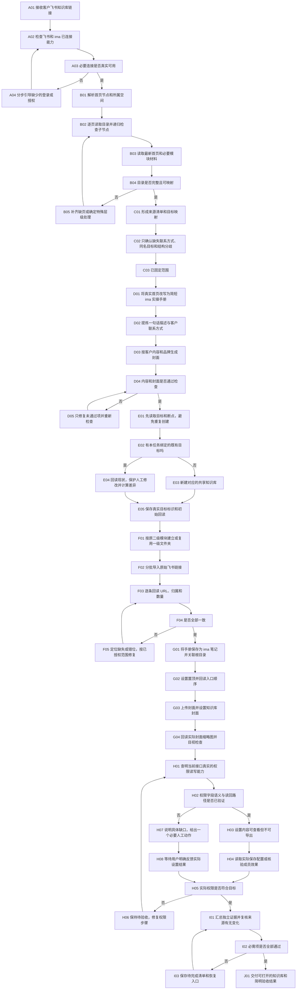

# 已确认流程与节点契约 · V1

流程是执行依据。每个节点检查输入/动作、必要客户回答、产物/证据、通过条件和失败接续；仅实际通过才能进入成功分支。客户已有授权、命名、联系方式和风格直接沿用。

## 详细流程图

## 节点契约

### A01 接收客户飞书知识库链接

- 输入与动作：客户提供的飞书知识库首页链接；确认本次目标是生成对应 ima 库
- 必要客户回答：只有来源缺失或链接含义不明时询问
- 产物与证据：保留原链接的任务记录
- 通过条件：来源明确且在客户授权范围内
- 失败与接续：等待正确链接；不搜索其他客户知识库

### A02 检查飞书和 ima 已连接能力

- 输入与动作：检查当前已连接飞书 CLI/连接器、ima API/连接器及生图能力
- 必要客户回答：已有授权沿用
- 产物与证据：连接能力表和实际只读调用结果
- 通过条件：能读取指定飞书来源、定位 ima 账号和目标范围
- 失败与接续：定位缺少的具体能力；不擅自安装或改系统设置

### A03 必要连接是否真实可用

- 输入与动作：分析只读响应，不凭工具名称判断已打通
- 必要客户回答：无
- 产物与证据：身份和读取结果
- 通过条件：实际调用成功且目标身份正确
- 失败与接续：转 A04

### A04 分步引导缺少的登录或授权

- 输入与动作：针对确实缺失的登录或授权，给新手当前一个必要动作
- 必要客户回答：由客户完成登录、授权等本人动作
- 产物与证据：授权反馈及重新实际调用
- 通过条件：连接与所需资源权限通过
- 失败与接续：回 A02；无授权不继续依赖的线上写入

### B01 解析首页节点和所属空间

- 输入与动作：解析首页的 node、space、正文对象；保存原始来源标识
- 必要客户回答：无
- 产物与证据：首页真实节点响应
- 通过条件：节点属于所给来源且可读取
- 失败与接续：回 A04 或 A01；不猜空间 ID

### B02 逐页读取目录并递归检查子节点

- 输入与动作：读取所有分页；仅在指定根节点下递归；检查循环、缺页和更深层级
- 必要客户回答：超过既定两层映射时才问结构选择
- 产物与证据：完整树、分页终止证据、逐节点清单
- 通过条件：全部页读取完，未把页数上限当作全量
- 失败与接续：补齐游标后接续；不从头重复建目标

### B03 读取最新首页和必要模块材料

- 输入与动作：读取最新首页；按手册与描述需求读取必要模块说明
- 必要客户回答：无
- 产物与证据：首页内容与来源版本/哈希
- 通过条件：表述来自真实资料；不把规划当已有正文
- 失败与接续：缺源则补源；不编造课程收益和权益

### B04 目录是否完整且可映射

- 输入与动作：检查首页、模块、原文链接是否能按本次要求对应
- 必要客户回答：特殊层级、同名模块或来源异常需客户选择
- 产物与证据：映射检查结果
- 通过条件：没有静默漏页、合并模块或改变原 URL
- 失败与接续：转 B05

### B05 补齐缺页或确定特殊层级处理

- 输入与动作：展示具体缺页或结构分歧，并给少量可比较处理方案
- 必要客户回答：必要时确认更深层级如何进入两层结构
- 产物与证据：已确认例外及原节点去向
- 通过条件：每个原节点有明确去向
- 失败与接续：回 B02/C01；未确认前不擅自压平

### C01 形成来源清单和目标映射

- 输入与动作：唯一首页→根手册；二级模块→一级文件夹；三级条目→对应原链接
- 必要客户回答：既定映射沿用，不重复询问
- 产物与证据：含源节点、源标题、源 URL、目标位置的清单
- 通过条件：逐项可核对，保留重复来源节点的真实语义
- 失败与接续：回 B04

### C02 只确认缺失联系方式、同名目标和结构分歧

- 输入与动作：从来源识别客户品牌与公开联系方式；检查同名目标和断点
- 必要客户回答：只问确实缺失的联系方式或目标选择；联系方式可选择不放
- 产物与证据：选择记录和命名方案
- 通过条件：不硬编码开发者或他人的联系方式或客户资料
- 失败与接续：等待必要选择；继续不依赖该答案的工作

### C03 已固定范围

- 输入与动作：保存来源基线、选择、内容范围及目标权限要求
- 必要客户回答：关键选择已授权则不重复询问
- 产物与证据：任务清单和可恢复状态
- 通过条件：后续写入能绑定到已确认范围
- 失败与接续：来源变化使相关内容验收失效，回 B03/C01

### D01 将真实首页改写为简短 ima 实操手册

- 输入与动作：把首页改写为新用户能立即理解的学习与使用手册
- 必要客户回答：业务事实有歧义时确认
- 产物与证据：手册稿、来源对照
- 通过条件：说明从哪开始、怎么找课、怎么操作与求助；不承诺 AI 一定读到受限原文
- 失败与接续：回 B03 或修订本稿

### D02 提炼一句话描述与客户联系方式

- 输入与动作：根据真实内容写一句话描述；仅使用已确认客户联系方式
- 必要客户回答：缺失联系信息时可省略或等待客户提供
- 产物与证据：描述稿和事实对照
- 通过条件：内容与本库匹配，无虚构承诺
- 失败与接续：回 C02/D02

### D03 按客户内容和品牌生成封面

- 输入与动作：按知识库主题、品牌与现有形象生成封面；未选人物不补造人物
- 必要客户回答：确有新关键品牌选择才问
- 产物与证据：生图真实返回、原图、提示词
- 通过条件：真生成、字准、清楚、缩略图易辨识
- 失败与接续：修复生图能力或重新生成；不以占位图冒充完成

### D04 内容和封面是否通过检查

- 输入与动作：人工检查手册表达、链接、描述及封面
- 必要客户回答：材料已明确时无需逐句审批
- 产物与证据：逐项内容检查与封面目视记录
- 通过条件：关键事实和视觉均合格
- 失败与接续：转 D05

### D05 只修复未通过项并重新检查

- 输入与动作：定位问题，只修指定内容；失效的相关证据随之更新
- 必要客户回答：无
- 产物与证据：修订产物及重新验收
- 通过条件：对应问题实际解决
- 失败与接续：回 D04；连续失败保留断点并说明具体缺口

### E01 先读取目标和断点，避免重复创建

- 输入与动作：先回读本次断点和目标现状；按来源绑定识别既有目标
- 必要客户回答：同名却无绑定关系时需客户选定
- 产物与证据：目标候选与差异
- 通过条件：不是仅凭同名自动覆盖
- 失败与接续：回 C02；不清空现有库

### E02 有本任务绑定的既有目标吗

- 输入与动作：核对既有目标是否与本来源和本任务绑定
- 必要客户回答：无
- 产物与证据：来源—目标绑定
- 通过条件：目标唯一、身份正确、范围可写
- 失败与接续：无绑定转 E03；有绑定转 E04

### E03 新建对应的共享知识库

- 输入与动作：在授权账号内创建对应共享知识库，设置名称及描述
- 必要客户回答：新关键名称仅在不能沿用源名时确认
- 产物与证据：真实创建响应及回读
- 通过条件：名称、描述、共享类型和账号正确
- 失败与接续：先查询创建结果，超时不盲目重建

### E04 回读现状，保护人工修改并计算差异

- 输入与动作：回读人工修改与已有内容，计算新增、保留和冲突
- 必要客户回答：涉及覆盖、移动、删除等超出既有授权的冲突需确认
- 产物与证据：现状快照与差异清单
- 通过条件：保护用户已完成的内容及权限
- 失败与接续：回 C02 或等待冲突决定；不自动删除

### E05 保存真实目标标识和初始回读

- 输入与动作：持久化接口返回的真实目标标识，不在客户正文展示后台 ID
- 必要客户回答：无
- 产物与证据：任务状态与目标读回
- 通过条件：恢复时能找到同一目标
- 失败与接续：写入状态失败则停下，避免接续失去目标

### F01 按原二级模块建立或复用一级文件夹

- 输入与动作：逐模块创建/复用对应一级文件夹，保存源节点绑定
- 必要客户回答：原模块标题沿用
- 产物与证据：文件夹实际回读
- 通过条件：数量、名称、根归属一致
- 失败与接续：查询已创建状态再修复，不因超时重复创建

### F02 分批导入原始飞书链接

- 输入与动作：分批导入飞书原链接，保存每条真实返回及失败项
- 必要客户回答：无
- 产物与证据：逐条导入结果和绑定
- 通过条件：不替换、缩短、重定向改写或混入正文文件
- 失败与接续：任一依赖失败停该批，已完成项保留

### F03 逐条回读 URL、归属和数量

- 输入与动作：逐文件夹分页读取；逐条读取媒体原 URL；核对原节点、归属和数量
- 必要客户回答：无
- 产物与证据：实际 URL 相等检查、父文件夹检查、计数
- 通过条件：每个映射项都对应真实条目，URL 字符串一致
- 失败与接续：转 F05；仅数量相等不算通过

### F04 是否全部一致

- 输入与动作：汇总缺失、错位、重复与差异
- 必要客户回答：无
- 产物与证据：结构比对结论
- 通过条件：必需原链接全部对应
- 失败与接续：未通过转 F05

### F05 定位缺失或错位，按已授权范围修复

- 输入与动作：按差异定位修复缺页或错归属；保护本次范围外内容
- 必要客户回答：移动、删除需要对应授权
- 产物与证据：修复记录和新回读
- 通过条件：问题实际消失且未引入额外改动
- 失败与接续：回 F03；保留失败项及下一次入口

### G01 将手册保存为 ima 笔记并关联根目录

- 输入与动作：UTF-8 检查后保存真实 ima 笔记，再关联知识库根目录
- 必要客户回答：无
- 产物与证据：笔记内容读回与根目录条目
- 通过条件：实际正文、标题、位置正确
- 失败与接续：分别区分笔记已建和关联未完成，避免重复建笔记

### G02 设置置顶并回读入口顺序

- 输入与动作：设置置顶或当前连接支持的明确首读入口，并回读
- 必要客户回答：若置顶不可用且需改变交付形式才问
- 产物与证据：置顶字段或实际列表首项与入口证据
- 通过条件：客户进入后能先找到手册
- 失败与接续：不能置顶则明确待完成，不把标题“先看”当置顶

### G03 上传封面并设置知识库封面

- 输入与动作：原始封面通过 ima 文件上传链路后设置知识库封面
- 必要客户回答：无
- 产物与证据：上传回执、媒体 URL、封面设置回执
- 通过条件：实际上传链路通过；不猜 URL，不使用未经验证的临时地址
- 失败与接续：失败停止后续封面步骤；保留成功的其他内容

### G04 回读实际封面缩略图并目视检查

- 输入与动作：回读知识库实际封面 URL 和实际缩略图；目视检查
- 必要客户回答：无
- 产物与证据：元数据、图片可访问性和目视结论
- 通过条件：不是默认封面，主题、文字、裁切及清晰度正确
- 失败与接续：回 D03/G03；本地图正确不代表线上封面正确

### H01 查明当前接口真实的权限读写能力

- 输入与动作：核对当前连接的实际权限读写接口和枚举定义
- 必要客户回答：无
- 产物与证据：权限能力与字段语义依据
- 通过条件：有明确的实际配置回读或成员效果验证路径
- 失败与接续：转 H07；禁止猜测枚举并批量试写

### H02 权限字段语义与读回路径是否已验证

- 输入与动作：区分接口提交成功、实际保存成功、成员效果通过
- 必要客户回答：无
- 产物与证据：权限操作方案
- 通过条件：设置与核验均能执行，字段意义有依据
- 失败与接续：无法核验转 H07；不提前给完成状态

### H03 设置内容可查看但不可导出

- 输入与动作：通过已确认语义的接口设置成员内容可查看且不可导出
- 必要客户回答：沿用客户已确认要求
- 产物与证据：实际请求与响应，凭证不写日志
- 通过条件：只标记“已提交”，不能直接标权限完成
- 失败与接续：失败回 H01；不能以 code=0 代替权限验收

### H04 读取实际保存配置或核验成员效果

- 输入与动作：回读实际配置，必要时由已授权成员验证查看和导出行为
- 必要客户回答：用户本人或已授权成员需要操作时，给一个清晰步骤
- 产物与证据：实际配置或成员端结果；明确来源、目标与时间
- 通过条件：“可查看”和“不可导出”两项均有实际证据
- 失败与接续：转 H06；不得用创建者权限推断普通成员权限

### H05 实际权限是否符合目标

- 输入与动作：判断实际权限证据是否满足目标
- 必要客户回答：无
- 产物与证据：权限最终状态
- 通过条件：有实际核验；人工完成须标记为人工完成
- 失败与接续：没有证据继续待验收，不算全自动完成

### H06 保持待验收，修复权限步骤

- 输入与动作：针对真实配置不一致修复；保留用户刚手动改好的设置
- 必要客户回答：如果用户已手动设置，不再擅自重新写入
- 产物与证据：失败与更正记录
- 通过条件：修复后重新核验
- 失败与接续：回 H01；用户手动反馈优先于旧接口回执

### H07 说明具体缺口，给出一个必要人工动作

- 输入与动作：说明当前接口缺少哪个具体能力，提供必要的手动设置指引
- 必要客户回答：只请求当前必要动作；不让客户完成其余可自动操作
- 产物与证据：待完成项与一步指引
- 通过条件：诚实保留缺口，无屏幕共享或电脑控制操作 ima
- 失败与接续：转 H08；等待期间可完成其他独立任务

### H08 等待用户明确反馈实际设置结果

- 输入与动作：等待用户明确反馈实际权限已按要求保存
- 必要客户回答：用户明确确认实际结果
- 产物与证据：用户反馈的原文记录、时间及目标
- 通过条件：反馈针对本库及指定权限；标为用户手动完成
- 失败与接续：未收到明确反馈继续待验收；时间流逝不算确认

### I01 汇总独立证据并复核来源有无变化

- 输入与动作：汇总真实在线证据，并复查源目录/首页是否发生相关变化
- 必要客户回答：无
- 产物与证据：完整验收清单和来源版本比较
- 通过条件：所有必需项均有相应独立证据
- 失败与接续：来源变化回 B03/C01；不因已打包而跳过

### I02 必需项是否全部通过

- 输入与动作：按必需项判定内容完成、权限待验收或全项通过
- 必要客户回答：无
- 产物与证据：机器检查与实际验收分开记载
- 通过条件：缺任一必需证据就不标全项通过
- 失败与接续：转 I03

### I03 保存待完成清单和恢复入口

- 输入与动作：保存已做、未做、人工完成、失败原因和恢复节点
- 必要客户回答：只问继续所需的最少问题
- 产物与证据：断点、真实目标、未完成清单
- 通过条件：下一次能从真实现状继续
- 失败与接续：不新建重复库，不凭聊天摘要猜进度

### J01 交付可打开的知识库和简明验收结果

- 输入与动作：交付知识库可打开入口、手册位置、文件夹/链接数和实测边界
- 必要客户回答：无
- 产物与证据：简明客户交付说明
- 通过条件：完成声明严格对应证据，人工步骤如实注明
- 失败与接续：打不开或验收不齐则返回对应节点
