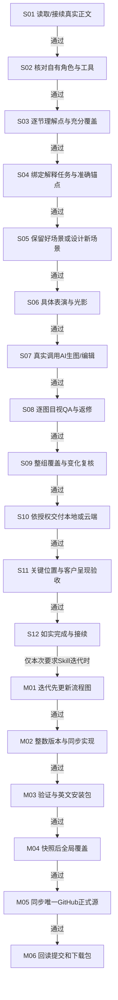

# V2 确定流程图与逐节点执行卡

当前明确建议已作为本轮确定选择；先改此图，再更新实现。失败返回对应节点，已确认选择不重问。

## 用户自有角色配图完整执行与迭代流程

|节点|输入|动作|客户确认|产物/证据|通过条件|失败返回|接续|
|---|---|---|---|---|---|---|---|
|S01 读取/接续真实正文|当前授权、最新正文、旧run|读取全文及原有资源；记录版本和授权模式|沿用已确认选择；仅实际缺失的关键选择才询问|正文快照、原图/资源清单；保存本节点实际产物、来源和检查结果|实际正文可读，未扩展授权|补正文/权限后重读|S02|
|S02 核对自有角色与工具|当前角色配置、真实参考、工具能力|核对归属、家族、版本，实际看主锚图；原生参考输入可用|沿用已确认选择；仅实际缺失的关键选择才询问|角色与能力记录；保存本节点实际产物、来源和检查结果|须用户已授权并确认的自有主参考|定位参考或完成自有角色安装魔改，不能借他人角色|S03|
|S03 逐节理解点与充分覆盖|全文、原图清单|识别核心判断、步骤、卡点、转折、误区、闭环，逐点配/不配及理由|沿用已确认选择；仅实际缺失的关键选择才询问|覆盖表、实际N；保存本节点实际产物、来源和检查结果|重要理解点不漏；无固定张数或惯例上限|返回正文补点，复杂点拆图|S04|
|S04 绑定解释任务与准确锚点|理解点、前后段落/表格|写本图帮助客户理解什么，绑定准确语义位置|沿用已确认选择；仅实际缺失的关键选择才询问|锚点与一句话解释目标；保存本节点实际产物、来源和检查结果|不是装饰，不按字数平均摆放|重定解释任务及锚点|S05|
|S05 保留好场景或设计新场景|原图/新需求、主题情境情绪|已有优质场景定向编辑；新增按内容选环境/动作/道具/景别/配色|沿用已确认选择；仅实际缺失的关键选择才询问|scene与edit/preserve计划；保存本节点实际产物、来源和检查结果|丰富灵动，不能连续套桌旁，也不复制帐篷模板|回S04修含义，或重设场景|S06|
|S06 具体表演与光影|当前理解变化、已确认角色|明确眉眼/嘴型/视线/身体反应；方向光、层次、材质、接触阴影|沿用已确认选择；仅实际缺失的关键选择才询问|expression与lighting字段；保存本节点实际产物、来源和检查结果|有趣夸张但身份气质稳定；单主角默认|重写具体表演/光影，不用一句更精致|S07|
|S07 真实调用AI生图/编辑|已核对参考、精确提示词|每张独立真实传参考生成PNG，保留调用及来源|沿用已确认选择；仅实际缺失的关键选择才询问|PNG、提示词、参考哈希、原始来源；保存本节点实际产物、来源和检查结果|真实工具输出、16:9、可打开；原件保留|失败只重试该张；工具不可用保存断点不充数|S08|
|S08 逐图目视QA与返修|PNG、正文锚点、主参考|逐项看含义/身份/人体/表情/中文/物理关系/环境/光影/清晰度|沿用已确认选择；仅实际缺失的关键选择才询问|逐图QA、返修链；保存本节点实际产物、来源和检查结果|关键项全通过才计数，局部编辑须保护已通过部分|局部修错；损质回原始参考重做→S07|S09|
|S09 整组覆盖与变化复核|全部通过图、shot list|核对关键点是否漏图、无关装饰、表情/场景重复及质感退化|沿用已确认选择；仅实际缺失的关键选择才询问|整组复核证据；保存本节点实际产物、来源和检查结果|每图有解释价值，变化服务内容，不为多样性牺牲一致性|漏点→S03；重复/质感→S05/S06|S10|
|S10 依授权交付本地或云端|通过图、授权模式|本地交付；云端先读最新目标并保护正文、原图、表格、附件、链接|沿用已确认选择；仅实际缺失的关键选择才询问|PNG或目标资源映射；保存本节点实际产物、来源和检查结果|用户要原文修改则局部更新；要副本才新建，不自行换目标|回读目标并定位未完成写入，防重复创建|S11|
|S11 关键位置与客户呈现验收|准确锚点、云端/内容包|核对实际插入位置及图文承接；客户不出现来源/制作标注|沿用已确认选择；仅实际缺失的关键选择才询问|readback、placement、preview证据；保存本节点实际产物、来源和检查结果|约760px等比例、实际渲染清楚，原图资源完整|只修失败块；上传/哈希不代替可读验收|S12|
|S12 如实完成与接续|全部真实证据|分别报告图/页面/平台实测范围和未完成项|沿用已确认选择；仅实际缺失的关键选择才询问|完成或断点记录；保存本节点实际产物、来源和检查结果|脚本/模拟不冒充目视；局部不冒称整库完成|缺哪项补哪项，不擅自宣告通过|DONE（仅已要求迭代时进入M01）|
|M01 迭代先更新流程图|稳定反馈、当前版本|先更新流程图与节点，沿用已确认选择|沿用已确认选择；仅实际缺失的关键选择才询问|新版图与建议映射；保存本节点实际产物、来源和检查结果|图与执行规则对应，不新增未确认业务选择|补关键选择后定图|M02|
|M02 整数版本与同步实现|确定图、历史源|新建下一Vn，更新主文件/参考/脚本/模板/说明/UI|沿用已确认选择；仅实际缺失的关键选择才询问|私有维护源、公开安全源；保存本节点实际产物、来源和检查结果|历史完整保留，公开源无内部角色配置/资产|修正冲突或脱敏后再构建|M03|
|M03 验证与英文安装包|新版源、回归/真实证据|校验流程和行为、资源完整性，构建根目录SKILL.md英文ZIP|沿用已确认选择；仅实际缺失的关键选择才询问|安装包、SHA、验证报告；保存本节点实际产物、来源和检查结果|测试边界真实；公开与私有分离|修源并重打包|M04|
|M04 快照后全局覆盖|已验证包、现有安装|保存旧安装快照，覆盖当前目标，逐文件回读|沿用已确认选择；仅实际缺失的关键选择才询问|安装快照与哈希对照；保存本节点实际产物、来源和检查结果|当前安装与内部新版源一致，其他Skill不改|保留现场并恢复快照或修包|M05|
|M05 同步唯一GitHub正式源|公开安全源、ZIP、当前远端|正常提交推送，同步市场/产品页/公告/历史；不强推|沿用已确认选择；仅实际缺失的关键选择才询问|远端提交与版本路径；保存本节点实际产物、来源和检查结果|仅banmu23/banmu-skills；内部资产不公开|真实网络/隐私阻断如实记录，不说已同步|M06|
|M06 回读提交和下载包|远端提交与下载路径|读回提交，下载ZIP并核对根目录/文件/SHA/安装路径|沿用已确认选择；仅实际缺失的关键选择才询问|完整发布验收；保存本节点实际产物、来源和检查结果|提交回执不等于发布；客户升级仍确认|回M03/M05修复缺项|DONE|
